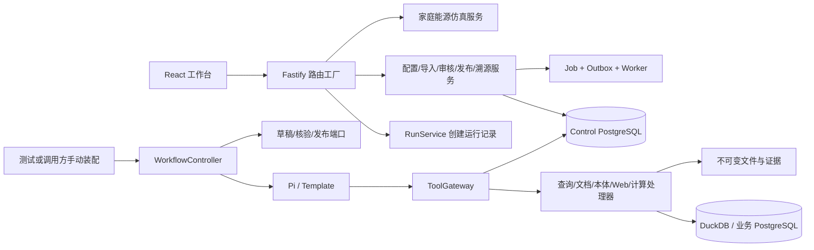

# SPEC：行业语义与业务 Agent 平台——当前实现

> 快照更新提醒：本文基线之后已提交 LOCAL-072 的公司模型兼容 codec；有关该增量和当前工作状态，先看 [HANDOFF.md](../HANDOFF.md)。本文正文保留原基线的逆向记录。

> 逆向规格，2026-09-23，基于 `527a79c5d844c222b03a7442fd3beffaed5741be` 的代码、配置与测试。
> 已补入审查期间新增的 `bd60168`：环境 SecretResolver 与真实模型验证工具。以下区分本轮亲自运行的检查和该提交记录的外部验证，不将新增工具误记为集成已经成功。
> 本文描述已经存在的行为和边界，不替代 [PRD v0.2](../tasks/prd-industry-semantic-agent-v0.2.md) 与[目标技术规格](../tasks/spec-industry-semantic-agent-v0.2.md)。已确认缺陷见[审查清单](reviews/2026-09-23-code-review.md)，下一步结构见[场景解耦方案](scenario-decoupling-2026-09-23.md)。

## 1. 总览

工程由通用 TypeScript 契约/服务、可注入的运行时/数据/模型适配器、React 工作台、Fastify 路由工厂、后台任务与家庭能源扩展组成。它已具备较多可独立运行的基础组件，但正式宿主装配、HTTP 工作流调度和业务回答正文链路尚未闭合，不能将测试环境的完整装配等同于可直接部署的产品。

### 1.1 已实现能力与状态

| 能力 | 当前实现 | 实际边界 |
|---|---|---|
| 组件注册与场景解析 | ComponentRegistry、ProfileResolver，PostgreSQL store | 校验兼容性、能力、映射与降级；不自动加载任意第三方包 |
| 客户数据来源 | SourceRegistry，来源绑定/版本/探测，PostgreSQL 和 DuckDB 适配 | 没有通用“接入任意数据库”驱动；DataOS 不是当前内核依赖 |
| 文档处理 | 纯文本/Markdown/PDF 解析、块与来源位置、不可变原文 | DOCX 未支持；PDF 可注入 OCR provider，未配置时缺少文字层的页显式跳过 |
| 文档检索 | BM25 关键词索引、重建、搜索与证据 | 向量、hybrid 模式未实现；检索组件存在不等于最终 RAG 回答已接通 |
| LLM 抽取 | schema 驱动的实体/关系/规则候选，验证与审核移交 | 模型需注入；新增报告记录公司端点可达，但平台生成适配协议不兼容 |
| 实体消歧 | 候选召回、约束、同一/不同实体裁决、审核版本 | 人工决策与候选隔离；不是全自动高精度合并保证 |
| 语义发布 | 候选审核→官方 statements/rules，修订和撤回 | 版本/事件/作用域持久化，规则执行存在 R03/R04 等缺陷 |
| 派生与溯源 | RuleEvaluator、IncrementalMaterializer、支撑 DAG、历史读取 | 有界规则子集；首批读取缺口见 R05，不能宣称任意本体推理 |
| Agent 运行时 | Template 与 Pi 两个适配器 | 控制器可直接运行；HTTP 入口尚未调度它（R01） |
| 工具与预算 | 四工具目录、gateway、local/MCP、共享账本 | SDK 不拥有额外权限；远程 MCP 部署未验证 |
| 草稿核验 | DraftVerificationService、确定字段检查、JEV 判断接口 | 正文/时间覆盖缺陷与缺少实际语义输入见 R06/R07/R09 |
| 答案发布 | AnswerPublicationService 与 PostgreSQL 元数据存储 | 尚无正式正文生成/读取闭环，工作流部分状态仅内存 |
| 家庭能源 | 行业声明、归一化、候选计划、模拟、UI | 合成场景，只读/仿真；不包含已验证的 HA 实机与设备控制 |
| 其他行业 | 交通政务、医疗、汽车准备包 | 准备说明，不是完成的行业场景 |

### 1.2 实际运行形态



图中没有 `HTTP 创建 run → WorkflowController` 的执行连线，这正是当前缺失的装配。API/Worker 的 `index.ts` 导出工厂和类，未找到面向应用部署的完整 bootstrap、配置加载与启动命令；现有可复现运行入口主要是测试 harness。

## 2. 技术栈与构建

| 层 | 代码中的选型/版本约束 | 说明 |
|---|---|---|
| 语言 | TypeScript `^5.9.3`，ESM，strict | schema 边界与手写类型并存 |
| Node | `.nvmrc` 为 22，engines >=22 | 本轮验证实际使用 v24.18.0；未验证所有受支持 Node 版本 |
| 包管理 | pnpm 11.17.0，workspace | 30 个 package.json（含根包，不含架构测试 fixture 包） |
| HTTP | Fastify `^5.12.5` | 路由按依赖是否注入而注册 |
| UI | React/React DOM `^19.3.0`，Vite `^7.3.6` | 6 个固定页面，CSS 响应式布局 |
| Agent | Pi agent-core/pi-ai 0.87.0；本地 template | 两个真实 runtime 适配模块 |
| SQL | pg；pgsql-ast-parser `^12.0.2`；DuckDB Node API `^1.5.5-r.5` | 各包具体版本由 lockfile 固定 |
| 协议/Schema | MCP SDK 1.30.0；AJV；JSON Schema→生成 TS | 协议实现与领域端口分离 |
| 解析 | unpdf 1.8.1 与本地解析逻辑 | 解析覆盖/精度需要保留在输出 |
| 测试 | Vitest `^5.0.1`，Playwright `^1.62.0`，jsdom | 分 unit、architecture、integration、load、acceptance、browser |

包、路由与表的完整枚举见[实现清单](spec-as-built-2026-09-23-inventory.md)。版本为当前仓库声明或锁定值，不是建议追随的最新版本。

## 3. 模块与依赖

```text
platform/
  packages/contracts/             公共 Schema、类型、端口、错误、生成脚本
  packages/core/                  共享预算等通用策略
  packages/application/           注册/场景/来源/作业/抽取/工作流/核验/包管理
  packages/tool-services/         固定工具目录、gateway、查询/compute 等 handler
  packages/semantic-engine/       定义/映射/消歧/发布/规则/物化/历史
  packages/provenance/            证据读取、依赖展开、受控导出
  packages/adapters/              runtime/model/data/control/blob/search/transport/parser
  packages/extensions/home-energy/归一化、预测读取、规划、仿真、计算处理器
  industry-packs/                 home-energy 声明；其他行业准备包
  deployment-profiles/           home-energy-demo 示例引用配置
  apps/api/                      路由与装配工厂，含能源专属代码
  apps/worker/                   作业循环、物化消费者，含能源模拟 stage
  apps/web/                      通用工作台与能源 UI 的当前共同宿主
  migrations/control/            57 个应用表及其索引、作用域策略与演进
  tests/                         fixture、单元、契约、集成、UI、组合和负载
```

核心通过 contracts 端口依赖外部能力；contracts 不依赖具体适配器；框架内不存在必须访问原 Python 演示原型的路径。包级 import/SDK 规则由 architecture 测试检查。

**当前场景边界**：home-energy 的声明与算法已经独立，通用 core/application 未发现硬编码家庭能源的执行分支。但 apps/api、apps/web、apps/worker 的公开出口、路由、客户端、导航和 Worker stage 仍直接依赖能源模块。当前 package 边界不足以保证卸载能源场景后宿主完全不改。

## 4. 数据模型与状态

### 4.1 主要逻辑实体

| 实体 | 核心字段与关系 | 存储/约束 |
|---|---|---|
| Scope / Principal | tenantId、spaceId；subjectId、roles/scopes、authEpoch | 可信宿主建立 ToolContext；请求正文不提供可信身份 |
| VersionRef / ResourceRef | id、version、digest；资源增加 kind | 用于 profile、schema、工具结果、文档、证据、checkpoint 等引用 |
| ComponentVersion | manifest、kind/id/version/digest、能力与兼容范围、生命周期 | PostgreSQL 版本表/活动引用/事件 |
| ProfileSpec / ResolvedProfile | 行业/扩展/映射/数据/模型/runtime/transport 引用、工具 policy、快照 hash | 原定义、解析快照与活动绑定分别保存；运行锁定解析结果 |
| SourceBinding | sourceId、adapterRef、作用域、secret 引用、来源版本和 probe 结果 | 不把连接密码作为公共字段返回 |
| Run | runId、owner、profileRef、resolvedProfileHash、runtimeRef、question/context/preferences、state/revision、幂等键 | 同作用域同键同内容复用；不同内容冲突；事件与 checkpoint 分表 |
| BudgetLedger | run/job 归属、limits、保留/消耗/未知状态 | reservation + tool intent；工具并发与修复共享限额 |
| Job / Attempt | 输入/管线版本、kind、stage、counts/errors；attempt 的 lease/worker/state | 稳定逻辑任务与每次执行分开；checkpoint/outbox/发布记录独立 |
| Blob / Document / Chunk | 内容 digest、mediaType、byteSize、引用授权；解析版本与 span/覆盖 | 大文本/结果留在不可变 blob；PostgreSQL 保存授权与来源元数据 |
| Candidate / Decision | schemaRef、对象/关系/规则候选、sourceSpans、审核状态；实体身份决策与版本 | 候选不是已发布事实；消歧和审核有显式事件 |
| PublishedStatement | statementId、propositionKey、subjectEntityId、predicate、value/unit、有效时间、recordedAt、version/status、sourceRefs | 当前 published view 与 statement_revisions；撤回保留历史 |
| PublishedRuleVersion | ruleId/version、objectId、expression、exceptions、有效时间、来源与影响等级 | AST 被支持子集编译；不能把当前编译缺陷当成正确语义 |
| Projection / Fence | proposition、validity、recordedSeq、水位/代数、支持与结论 | 投影切片与失效屏障分开，用于增量/历史访问 |
| EvidenceRecord | evidenceRef、scope、producedBy、sourceSnapshots、resultDigest、dependencies、payloadRef、dataMode | 证据 envelope 持久化，结果通过 blob 引用 |
| AnswerDraft / Verification | blocks、claims、contentHash、evidenceManifestHash；verdict、findings、policyVersion | DraftWriter 及工作流/核验存储未完成正式部署链路 |
| PublishedAnswer | answerId、runId、draftId、verificationId、三个 hash、publicationKind、limitations/asOf、publishedAt | PostgreSQL 只保存发布元数据，无正文/可读引用（R02） |

57 个控制表的列名、类型与 migration 链接见[数据库清单](spec-as-built-2026-09-23-inventory.md#控制数据库)。外键、唯一键、索引、CHECK 和 RLS 应以 migration 为完整定义，不从上表推测。控制存储与业务查询存储逻辑分开；数据库池经事务内 tenant/space 设置施加作用域，部署须使用对应应用角色。

### 4.2 两类状态机

- Run：`created → preflight → collecting → drafting → verifying → published`；存在 `awaiting_input / cancelling / cancelled / blocked / failed` 分支。控制器可补查/修复，公开事件不把草稿流作为已核验答案。
- Job：`received → parsed → extracted → validated → awaiting_review → published`；存在 `failed / cancelled / rejected`。Worker 自主处理前四个 runnable stages，审核等待点停止；重试是同一逻辑 job 的新 attempt。

当前恢复能力有边界：run/checkpoint 与 job 的多种记录有 PostgreSQL 实现，但 WorkflowManifestStore 和 VerificationStorePort 只有内存实现。不能由“存在 resume API”推导出跨进程完整恢复。

## 5. API 与工具契约

### 5.1 HTTP 通用约定

API 命名空间 `/api/v1`。Fastify 工厂接受 `authenticate`，各 surface 建立受信上下文后调用应用服务；未配置的 surface 可以完全不注册，而不是每个服务总有路由。认证生产接入由调用方提供，仓库不包含完成的 OIDC/JWKS 部署装配。

常见成功 envelope 为 `{data, meta:{traceId, revision?}}`，错误为 `{error:{code,message,retryable,...}, traceId}`。创建接口使用 Idempotency-Key，审核/版本写入使用 If-Match/revision；具体必填与状态码见各路由，不能假设所有 POST 同构。

现有 44 个路由按能力分组：

| 分组 | 入口 | 行为 |
|---|---|---|
| 配置 | components、profiles/preflight/activate、sources/probe | 列组件、保存 profile、检查兼容与激活、来源登记探测 |
| 问答 | runs、runs/scope、events、responses、cancel、resume、answer | 当前创建/修改记录及读取状态；自动执行缺 R01；answer 缺正文 |
| 导入 | ingestions、jobs/:id、retry | 建立导入 job，读取进度，重试 |
| 消歧/审核 | candidates、source、decisions、reviews | 分开执行身份决策与批准/拒绝发布审核 |
| 语义发布 | semantic-publications、statements/revisions、propositions | 发布版本、修订/撤回、查询支撑状态 |
| 证据 | evidence、dependencies、export、objects/history | 按授权读取证据、分步展开支撑与历史 |
| 行业包 | industry-packs、export、upgrade、retire | 可复用资产导出、升级校验与退役 |
| 能源 | simulations/inputs、simulations、executions | 合成输入、已注册计算、模拟执行；拒绝 live |

逐个方法、路径、源码行位于[HTTP 清单](spec-as-built-2026-09-23-inventory.md#http-路由)。

### 5.2 关键请求与响应

**创建 run**：`POST /runs`，Idempotency-Key 必填。body 包括 `profileRef:{id,version}`、`question`、`context`、`preferences:{route,allowWeb}`；示例 context 可带 timeZone、siteRef。宿主生成 runId，身份与作用域由 authenticate 获取。返回 202 与 `{runId,state,eventsUrl,resolvedProfileHash}`。当前 API 不负责启动控制器。

**澄清/恢复**：responses 接收 clarificationId、typedResponse 以及预期 revision；resume 接收 checkpointId、runtimeKind/runtimeVersion、stateDigest 和预期 revision。校验运行所有权与版本。控制器恢复还依赖公共输入清单、固定 runtime 和原预算。

**读取答案**：有发布元数据则 200；运行仍在进行则 202；终态无答案则 404/ANSWER_NOT_AVAILABLE。PublishedAnswer 当前字段见 §4，响应不含可读业务内容。events API 读取 Last-Event-ID/lastEventId 之后的事件，写出 SSE 帧后结束本次响应，并非服务端一直保持的推送连接。

**语义发布**：`approvedCandidateRefs:[{candidateId,kind}]`、`schemaRef`，配合幂等键与期望 revision；候选批准、身份约束和正式发布视图是不同概念。修订/撤回为显式版本操作。

**能源仿真**：输入构造接收天气场景、备电需求；计算请求只接受 operationRef、受控参数与 inputRefs。`mode=live` 明确失败，不会把请求转发到设备 service。

### 5.3 模型工具目录

| 工具 | 输入/行为 | 返回约束 |
|---|---|---|
| ontology_lookup | 定义、对象/关系、映射或事实意图 | 来自版本化语义服务，不能把类型图边当事实支撑 |
| data_query | describe；direct SQL；semantic plan；已注册 compute | 数据/计算 payload、覆盖、来源、usage、证据；compute handler 不任意执行代码 |
| document_search | query、允许 collections、检索 mode | 当前 BM25；unsupported 模式不伪装向量成功 |
| web_search | 查询与域名约束 | 需已配置 provider、授权与 allowWeb；无来源不能声称完成 |

ToolGateway 执行 schema/权限/操作白名单、预算预留、取消/超时、结果有界归档与 evidence envelope。工具传输 local/MCP 共享业务处理器；身份不从模型工具参数推断。`final_answer`/`verify_result` 属于控制器内草稿和核验职责，不是任意选择跳过的公共数据工具。

## 6. 业务流程的实际实现

### 6.1 导入、抽取与发布

来源/原文 artifact → Job → DocumentParseStageHandler → 解析文本/块/来源位置 → ExtractionPipeline → 实体、关系、规则候选 → schema/冲突等校验 → awaiting_review → 身份决策/候选审核 → SemanticPublicationService → 正式 statements/rules 与 outbox → MaterializationOutboxConsumer。

候选生成依赖公司 GenerationPort；部分实体相似度判断可以使用独立决策端口。控制器预算、原文和 chunk lineage 为不同记录。解析和抽取成功不等于发布，发布不等于客户业务验收。

### 6.2 规则与物化

规则事实模型包含 subject、predicate、精确 decimal/string/boolean 值、有效时间、记录序列和来源；内核区分 unknown/conflict。支撑图表达“一个推导需要所有前提”和“一个前提可有替代来源”，避免展开所有证据组合。

已发布 AST 编译支持 all、比较、范围，以及可合并成相同 filter 的受限 any；relation 与 not 被明确拒绝。**当前 exceptions 静默遗漏、前提不绑定实体，属于错误而非产品规范**。当前 PublishedSemanticSource 仅取一次首批数据，不能代表大规模完整投影。

增量物化有依赖索引、失效 fence、投影切片和重放逻辑；查询包含业务有效时点与记录视图。溯源服务可读取原始依赖与派生支撑，不等同于执行 trace 或行业 schema 关系图。

### 6.3 问答、规划与回答

直接调用 WorkflowController 时，它创建 run、打开共享账本、固定 manifest、选择 runtime，收集证据，再依次生成草稿、核验、发布。Template 使用固定计划；Pi 通过注入 gateway 调用工具。框架事件不是发布凭据。

RunPlanner 与有界收证逻辑有独立实现；生成器可提议语义查询，由映射编译到一个 SQL。当前不能把存在 planner 类说成所有 HTTP/Pi 路径均已完整装配。常规 DraftWriter 仍是 RestrictedDraftWriter；完整核验器存在，但 acceptance 的主要控制器路径注入的是 RestrictedAnswerVerifier。

| NL2SQL 标准环节 | 当前覆盖 |
|---|---|
| 问题改写 | 未发现独立完整流水线 |
| 表召回/字段裁剪 | 有 catalog describe 和受限映射，未形成完整召回裁剪服务 |
| 动态 schema / few-shot | 工具 Schema 存在；业务库 schema/样例检索闭环未见完成 |
| 生成 SQL/语义候选 | 生成端口、runtime tool-call、RunPlanner 候选提议；正式接线不完整 |
| SQL/权限校验 | PostgreSQL AST/白名单/只读；DuckDB 受限语法/注册表/外部访问约束 |
| 查询执行与证据 | 实现两后端与 gateway 归档 |
| EXPLAIN/试执行 | 未见通用预执行流程 |
| 错误反馈修正 | 有预算/有限循环机制；完整 NL2SQL 专项闭环未验证 |
| 用户反馈回流 | 未见完整持久化/评测回流服务 |

上述差距与 LOCAL-071 范围重合；本文不把该卡自动标记完成。

### 6.4 家庭能源

行业包为 preview 声明，描述 site/device/measurement point、计量边界、功率/能量、价格、观测/预测、约束和计划。它与客户物理映射分开，现有标准引用不等于完成行业认证。

领域扩展进行单位与时间归一化、累计量差分、测点覆盖/重复计量校验、forecast 读取、候选策略生成、能量/功率/SOC 约束检查、成本计算和对比；缺失设备参数不默认认为具备。候选策略不是全局最优求解器，收益是给定输入和比较基线下的模拟结果。

compute 操作通过注册的版本化 ID 暴露，包括 plan/simulate 等模块能力；profile 决定实际启用的操作，不能由模型增加新操作。当前 API 自带合成 scenario catalog，UI 有固定能源导航，Worker 有专属 simulation stage。没有已配置的实机读取与 Action 驱动。

## 7. 配置与外部依赖

| 配置 | 位置/默认 | 实际用途 |
|---|---|---|
| Node/pnpm | `.nvmrc`、package.json、lockfile | 工具链与依赖 |
| VITE_API_BASE_URL | Web 默认空字符串 | 空值时请求同源 API |
| CONTROL_DATABASE_URL / DATABASE_URL | migration 脚本，无可用默认连接 | 前者优先，用 owner 连接显式执行 migration |
| CONTROL_MIGRATIONS_DIR | 默认仓库 migrations/control | 可覆盖迁移文件目录 |
| ControlPostgresConfig | 构造参数 | connectionString、pool、statement/connection timeout |
| 模型配置 | model-company/model-jev 的注入 config 和 SecretResolver | endpoint/model/credential；没有经验证的全应用 env loader |
| 环境密钥解析 | 新增 createEnvSecretResolver，可注入 env | 支持 env:/env://、secret://env/ 及裸变量名；SourceRegistry 装配默认使用它，返回 SecretValue |
| 人工模型验证 | scripts/validate-live-models.mjs | 接受 --env-file/ONTOLOGY_SECRETS_FILE；读取 ONTOLOGY_COMPANY_MODEL_*、ONTOLOGY_JEV_* 配置，分别报告 raw probe 和平台适配器结果，不在 CI 自动调用 |
| Profile / capability config | 版本化配置与引用 | runtime、数据、模型、操作、策略与降级，不存裸密钥 |
| 运行预算 | core/budget/limits.ts | 默认 120s、8 工具调用、2 修复、2 并行、总 1,000 行/262,144 字节 |
| 后台预算 | 同上 | 默认 600s、8 工具调用、2 修复、4 并行、100,000 行/16,777,216 字节 |

PostgreSQL 不可用会影响控制存储；业务库不可用影响对应查询；文件存储不可用影响原文/大结果与核验；模型不可用按 policy 降级或失败。Jev 当前 wire 协议错误见审查 R08；公司生成适配协议不匹配见 R13。新增的[真实模型报告](../platform/docs/live-model-validation.md)记录公司原始探针成功、平台适配调用 blocked、JEV 缺 endpoint 配置 blocked；本轮未重放其网络请求。向量、S3、HA 等能力为未配置/占位，不能默认为可切换部署。

## 8. 错误、权限与可观测性

- 可信上下文携带 principal、scope、允许资源、deadline、取消 signal 等；服务重复检查权限，PostgreSQL 通过应用角色与事务内 RLS 作用域执行。
- 常见失败包括 INVALID_ARGUMENT、FORBIDDEN、VERSION_CONFLICT、IDEMPOTENCY_CONFLICT、CAPABILITY_NOT_CONFIGURED、DEADLINE_EXCEEDED、BUDGET_EXHAUSTED、INSUFFICIENT_DATA 等，具体包再映射到公共 envelope。
- 模型结果、来源文本和 MCP 内容不授予更高权限。SQL 输入经过解析/白名单和数据库只读约束；来源引用与原文读取仍需授权。
- 工具结果/证据/预算/运行事件支持审计与进度显示；没有从代码确认一套完整生产监控部署。相同 evidence hash 也不能代替语义正确性判断。
- 取消后的迟到事件有 abandoned 处理，但 HTTP 路由尚未连接实际 controller.cancel，不能由底层机制推断 UI 取消已能停止所有运行。

## 9. 非功能边界

采用模块化单体加 Worker，不要求每包单独进程。已有有界查询/工具摘要、账本、批次、异步 job、重试与本地归档；没有足够证据给出客户 SLA。

数据规模扩展的当前突出限制是 PublishedSemanticSource 的首批读取，以及工作流/核验状态的内存实现。文档中预设的容量指标不能替代基于客户数据的实测。数组/Map 服务与内存替身在测试中有用途，但生产装配必须区分其生命周期。

## 10. 测试与验证

Vitest 默认配置包含 unit（单元/契约/UI 状态）、architecture、integration/composition、load、acceptance，后几组限制并发。数据库测试使用独立容器和显式命名卷；浏览器项目单独运行并记录截图/日志。

原基线实际通过：lint、三套 typecheck、88 文件/1,162 测试（unit+architecture）、3 文件/26 测试（acceptance）、Web 构建、6 文件/25 测试（browser）。新增提交另运行 3 文件/35 项相关测试并复查 lint/typecheck。没有重跑完整 integration/composition/load，也没有亲自重放真实模型/设备调用。

端到端测试存在直接 controller 调用、Restricted 服务和 seedAnswer；它们证明组件组合与 UI 行为，不能证明用户输入到业务正文的完整路径。独立诊断暴露的错误及修复验收条件见[审查清单](reviews/2026-09-23-code-review.md)。

## 11. 已知缺口与未证实事项

1. HTTP 工作流调度、可启动正式宿主、实际回答生成与内容存储尚不完整。
2. 本体规则的例外、实体绑定，以及大数据完整读取有确定缺陷。
3. 正文/时间的核验覆盖、Jev 协议与语义输入有确定缺陷。
4. 工作流清单、输入清单、核验记录缺少生产持久化适配。
5. 不同行业/客户的异构 schema 尚缺少完整替换验收，能源专属装配尚未从通用宿主完整隔离。最新设计要求见解耦方案；不强制新增独立场景包。
6. 其他行业、真实模型质量、真实设备接口、生产认证/部署、容量 SLA 仍需独立验证。

## 12. 本地复现入口

在 `platform/`，使用匹配工具链：

```text
pnpm install --frozen-lockfile
pnpm run lint
pnpm run typecheck
pnpm exec vitest run --project unit --project architecture --maxWorkers 4
pnpm run test:acceptance
pnpm run build:web
pnpm run test:e2e
```

后两类服务测试需本机 Docker/浏览器依赖。迁移脚本是独立命令，不能指向未经确认的生产库。当前没有可据此诚实写出的“一条 start 命令启动完整产品”；下一步应补部署宿主，而不是把 tests/acceptance-environment 直接当生产入口。
