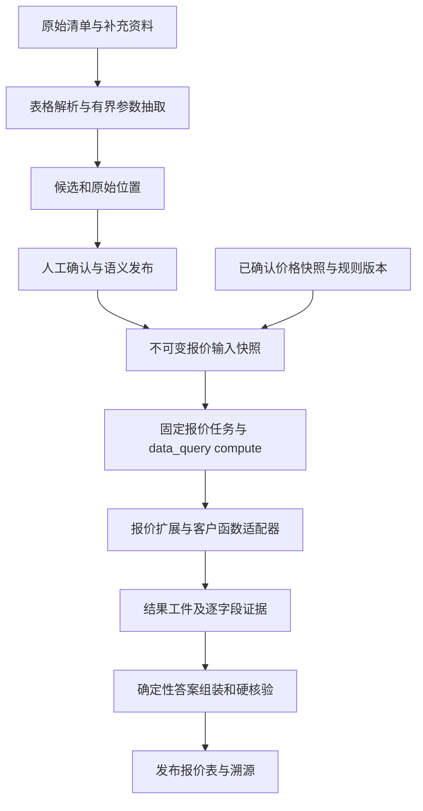
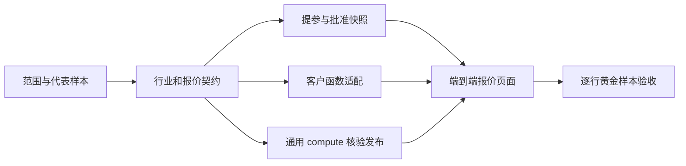

# 第一单 POC：电气桥架造价实施方案

日期：2026-09-29。状态：已建立开发分支，完成现状与资料静态核对；尚未实现造价场景、调用客户服务或开始业务验收。

开发分支：`feat/electrical-costing-poc`。最初按用户给定名称创建为 `feat/brige_cost`，在用户要求统一分支管理后改为按领域和用途命名。从已核对的 `origin/main@19c411e8db444e289e8c3ec0395ae909f2534601` 创建，工作目录为 `D:/work/ontology-core-main`。复用现有干净工作区，不再增加中间 Ontology 目录；文件夹名不决定当前分支。原 Anker 工作区和 Core 研发工作区保留各自的未提交工作。

需求依据：用户提供的《路桥AI造价师-项目交接-2026-09-29》v1.0。领域是电气安装中的电缆桥架，不是桥梁土建。本文更新旧规划里的工程状态；业务口径仍由项目负责人、客户和造价师确认。

## 1. 本轮要交付什么

做出一条可以复核的报价链路：用户导入清单和规格资料，确认系统提取的参数，选择已确认的计价口径，调用确定性报价函数，得到逐项报价表和解释，并能逐项查看原始依据。

第一条验收路径建议采用清单驱动的固定工作流，具体输入覆盖须与项目负责人和客户确认。模型用于规格理解、参数候选和语言解释；工程量、价格、税费和金额的计算归确定性函数。缺参数或口径冲突时暂停并要求确认，不能靠模型补齐后出价。

首期先选一个客户确认的代表性子集，例如一类桥架直线段及其明确配套项。直线段、盖板、弯通、支吊架是否一起计价，供货报价是否包含安装、运输等费用，都必须先确认。这个子集是实施建议，不是已获客户批准的缩减范围。

### 用户实际操作

1. 上传清单，查看原文件和导入行数。
2. 查看每行名称、规格、数量、单位，以及系统从哪个单元格或原文位置取得这些内容。
3. 修正或确认缺失参数、规格歧义和单位换算。未经确认的行不能进入正式报价。
4. 选择客户确认的价格基准、计价规则和费用范围，提交计算。
5. 查看逐行报价、合计和差异说明，展开任意数字的输入、规则、价格和函数调用记录。
6. 导出结构化结果；重新打开历史报价时，读到当时已核验的版本。

最终交付包括可操作页面、结构化报价工件、可读说明、逐项溯源、样本比对报告和使用文档。代码合并、演示成功、客户样本验收和公司内部 MVP 认定分别记录。

## 2. 资料与报价函数：现在知道什么

用户已授权静态检查本机客户演示包。本次没有启动客户端、执行打包业务代码、登录客户系统或调用客户后端；没有复制客户代码和真实资料到仓库。

| 材料或能力 | 已核对的事实 | 对实施的影响 |
| --- | --- | --- |
| 清单 XLSX | 单工作表，使用范围 596 行、5 列；表头包含名称、单位、规格、数量，没有报价金额字段；没有公式 | 可以用于表格解析与提参验证，不能独自证明算价正确 |
| 历史成本参考 XLS | 演示包说明明确它是成本/定价参考，不是待报价清单，也不能直接作为当前价格 | 先由客户确认适用日期与口径，不能当配对金标；本次没有解析其单元格公式 |
| 报价流程 DOCX | 有报价与成本算例 | 可用于访谈和函数对照，不自动等同于全部已确认规则 |
| PDF/DWG | 采购清单、图纸资料均存在 | 分清清单字段提取与工程量量算；存在文件不等于解析或量算能力已验证 |
| 客户客户端 | 找到了本地桥架算价逻辑，以及计算、预览、价格参数和项目报价的后端调用入口；直线段/规格分组与配件有不同计算路径 | 不是从零寻找函数；仍需确定权威入口、完整输入输出、权限、产品覆盖和复用方式 |
| 真实配对样本 | 暂未确认“同一原始清单＋同一价格/规则口径＋人工最终报价”配对关系 | 真实报价验收仍缺前提，不能拿不同项目的清单和历史价表凑金标 |

演示包说明自述已经接过模型能力，因此旧交接中的“无真正 AI”不能作为当前客观结论。可调用模型、能辅助提参与客户案例可自动报价是不同的验收层次，本次未独立验证其线上质量。

**下一步把客户现有计算路径定下来。** 优先接客户提供并认可的版本化函数或服务。客户端本地逻辑用于理解契约和对照；如决定把它作为首期计算实现，先确认复用范围、默认值、计算精度和结果签核。不能直接把演示默认价、占位价或历史价格作为正式输入。

静态检查还发现本地算法使用 JavaScript `Number`、`Math` 和字符串取小数位，并非精确十进制计算。外围 Decimal 适配不能修复内部已经发生的精度损失。应按客户确认的舍入阶段做对照，不擅自改算法造成与其现有报价不一致。配件缺成本的分支会进入 pending，首期必须保留这种缺价阻断，不能静默遗漏配件。

至少需要确定：供货还是工程综合造价、报价函数的权威版本、输入输出、价格快照、单位、税费与舍入方式、函数返回哪些明细、能否在固定输入下复算。录下 HTTP 响应可以实现历史回读；只有函数和价格/规则版本可以固定，才可承诺同版本复算。

## 3. Core 现状：不要重复搬旧补丁

本节依据当前代码与现有测试源码静态审阅；本次没有重新运行测试。主线已包含清洁 Core 合并，不应再整枝合并旧能源功能分支。

| 旧缺口 | 当前状态 | 本项目处理 |
| --- | --- | --- |
| K01：run 不分派、答案无正文 | 正常 HTTP 分派、核验后正文持久化已实现 | 复用；新增报价任务入口，而非重写 Controller |
| K03：发布属性无法成为规则输入 | 属性投影及按实体的有限规则实例已有实现 | 复用；算价公式仍在领域计算扩展 |
| K04：只读前 1000 条 | 来源分页、总上限和不完整错误已有实现 | 复用分页机制；默认 facts 计划每属性只读 100 条，不能拿它拼完整报价清单 |
| K06：抽取提示无行业 Schema | **仍存在**；Schema 用于校验，模型消息仍只有通用提示与原文 | 第一批补齐：传入固定版本的对象、属性、关系、单位与规则语法，并验证请求内容 |
| K07：已发布事实未进工具 | 属性事实已接 `ontology_lookup`；规则结论、关系、历史查询及四工具统一仍不完整 | 本单从已确认参数构建报价快照，不依赖全套语义查询先完成 |
| K08：运行策略和 ID/scope | canonical runId、可信 scope、固定 profile/runtime 绑定已有；通用规划仍未接完 | 首单用固定任务；通用自然语言 planner、JEV 路由与动态 loop 后置 |
| K09：配置 UI 不发布真实 profile | 发布、预检、激活已实现；没有完整 compute/model/tool 配置编辑器 | 先由服务端部署装配完整报价 profile；不要求先做万能配置页面 |

默认 Core 只接受最多三个属性的 `facts:` 任务，仅注册 Template runtime。其 compute registry 和 profile compute bindings 为空；`DataQueryHandler` 没有装配 compute。已有类和契约不等于页面可以直接完成报价。

还有两处容易遗漏：当前答案 writer 只读取属性事实，publication validity 也仅支持这一证据形态。**报价计算、答案字段核验和发布有效性必须一起接通。**

## 4. 架构与资产边界



### 建议目录

下列是拟新增职责，尚未创建这些实现目录；具体包名沿用仓库约定，不为每个文件都创建 npm 包。

```text
platform/industry-packs/electrical-costing/        行业语义、术语、身份、单位和有限规则声明
platform/packages/extensions/electrical-costing/  报价输入输出、确定性计算调度、结果解释依据
platform/packages/adapters/costing-*/             客户 HTTP/库/受控进程的具体 I/O 适配
platform/deploy/electrical-costing/               场景清单、profile、合成验证资料和配置模板
platform/apps/api/src/composition/               服务端显式挂载行业、任务、计算与证据能力
platform/apps/web/                               通过装配接入参数确认与报价展示组件
platform/tests/                                 通用契约、报价回归、HTTP/浏览器验收
```

- **通用 Core**：运行、预算、取消、配置、证据、核验、发布。只补缺少的通用能力，不引入材料名、桥架公式、税率或客户表列。
- **行业包**：可复用业务定义和经过确认的规则声明。保持声明式，不存价格、客户身份裁决、连接串或计算脚本。
- **报价扩展**：拥有 `costing.quote` 的领域契约，接收注入的报价计算能力；不直接绑定某个客户服务器。
- **客户适配器与映射**：客户列名、报价接口形状、执行方式和来源范围。业务规则归客户扩展或其规则版本，不冒充整个行业的标准。
- **客户原始资料与真实价格**：本机受控存储及授权环境，不进公开仓库、共享 fixture 或行业包。
- **本分支**：第一单开发和评审的短期分支。之后回流经过验证的通用补丁和脱敏行业资产，不长期以“一个客户一个分支”积累知识。

继续沿用 TypeScript、现有端口与显式装配。工具默认本地注册，`costing.quote` 通过既有 `data_query(kind=compute)` 执行，不新增第五个模型自由工具。出现跨进程/外部调用需求时再用 MCP 适配，共用权限和证据逻辑。

数据库先复用现有控制/证据存储。批量清单用有界任务和不可变工件承载；没有实测查询需求前，不为本单新增 StarRocks、Iceberg、向量库或新微服务。

## 5. 业务本体初稿

这一版服务于参数标准化、规格消歧、规则适用性和溯源；不以完整知识图谱或行业标准认证作为首期门槛。以下定义是候选，需造价师确认。

| 对象/记录 | 最少内容 | 身份与来源 |
| --- | --- | --- |
| Project / Inquiry | 项目范围、报价性质、地区/标准适用范围 | 租户/客户范围内的项目与询价版本 |
| Item / Specification | 直线段或配件类别、材料、宽/高/厚、表面处理、盖板等 | SKU 或审核后的规格组合；不能仅凭名称合并 |
| InquiryLine | 原始序号、Item、数量、计量单位、附加条件 | 询价＋源文件修订＋稳定行标识；同规格不意味着同一行 |
| PricingContext | 报价日期、币种、含税口径、费用范围、规则和价格快照引用 | 客户范围内的不可变口径版本 |
| PricingRule | 适用条件、明确例外、依据、生效范围和审核决定 | 规则 ID 与版本；规范、客户工艺、专家建议分别标来源 |
| Quote / QuoteLine | 计算输入引用、逐行金额、费用构成、限制与状态 | 报价/run/修订，以及原始询价行的对应关系 |

关系至少包括：询价包含行、行引用物品/规格、报价使用询价修订和计价口径、报价行对应询价行、参数与规则引用来源。

材质、密度、损耗率、板厚分档、折边、标准长度、盖板规则、配件配比、税率和报价系数不设未获确认的默认值。明确观测和经确认规则可以派生“需人工补参”“适用某规则”等结论；金额公式由计算扩展执行。

当前 ontology 属性没有独立 money/decimal 类型，quantity 单位固定在属性定义上；`UnitCode` 仅验证单位标记，不等于已经有换算服务。公共契约已有 `Money` 和 `DecimalQuantity`，报价的币种、税费、计价单位与舍入口径仍需在领域契约中显式组合。价格与报价明细优先存精确值工件，不把普通 number 属性当成金额真值。

米/毫米等同维度换算可以使用经定义的单位规则。米↔根、件↔套、吨↔产品单价必须有明确长度、组成或重量口径，不能只换单位标签。所有数值使用精确十进制表示；币种、税费基准和数量单位分开记录。

规则候选先审核，再生效。不支持的关系前提、递归或例外表达保持 unhandled，不能删掉条件使规则“可执行”。首期人工确认的显式规则即可启动，自动抽取所有行业规则后置。

## 6. 抽取与数据量处理

### 首先支持真实清单输入

当前主线网页接入主要是 UTF-8 文本/JSON，不能把已有 Excel 文件当作已支持格式。因此表格适配是第一批工作：解析工作表和行列，保留原文件 digest、sheet、row、cell，并把它们映射到候选与原文证据。如果内部首版用客户导出的 CSV/JSON 过渡，必须保留到原 XLSX 单元格的映射；这不等于完成 XLSX 上传验收。

先确定性读取数量、单位和显式列；模型仅解释混合规格、术语或补充说明。模型响应必须通过该行业版本 Schema、单位和来源定位校验。置信度可以排序人工审核，不能当作字段正确性保证，也不能越过审核。

每行或有界行组是处理单元。先用几条代表行核对契约，再扩到整份清单，避免将约 600 行一次发给模型。参数由文件大小、行数、输出长度与模型预算限制，实际批次大小和并发数经小样本试验决定。

现有 candidate 证据和 approve/reject 是候选级，不具备完整的逐字段确认状态。新增报价输入状态记录每个关键字段的值、定位、pending/confirmed/conflict、确认人、时间与修订；与原候选/实体 ID 关联。它属于报价领域输入契约，不把本项目需求扩成万能审核系统。

现有抽取 quantity 校验仅接有限 JSON number，尚不接受精确 decimal string quantity。进入报价的数量和尺寸必须从原始表示保持精确，不能先转成 number 再转回字符串。第一批增加通用 exact quantity 的校验/规范化与相关发布回归；确认工件始终保留原始值和规范值，报价快照不得混入未经修复的有损投影。

必须区分：原始行数、成功解析、等待确认、无法处理、批准报价、已计算和未覆盖数量。重复导入、按阶段重试、部分失败均可定位到原行。缺失数量、未知单位、冲突规格不变成零或默认值；部分成功不输出“完整合计”。

### 图纸作为独立、受条件约束的路径

- 采购清单 PDF：尝试文本层提取，保留页和位置，表格恢复质量需用真实样例验证。
- 图纸 PDF：先提取规格候选供原图复核；图上文字不能作为已核实工程量。
- CAD：专业软件导出明细、DXF 几何、图层/块/文字是不同能力等级，按客户实际输入和可用解析服务评估。DWG 不能承诺由现有 Core 直接处理。
- 扫描件/图片：可探索字段候选，首期不承诺工程量复核。

如果客户验收必须“仅有图纸也要量算”，先确认是否已包含在原业务约定中，再验证代表图纸，共同确定覆盖范围、回退方式与工期。不能单方面认定为新增需求或静默省略。图纸探索建议初次最多一个工程日；无法证明正确位置、单位和量算依据时，提出人工录入或专业导出路径，由项目负责人和客户确认未覆盖能力。

### 增量与物化

先复用已发布事实和有限规则物化机制。资料或规则修改后形成新修订，撤回/变更影响后续报价；旧报价保留原输入和证据。报价金额和中间计算保存为计算工件，不要求把每个中间数都物化成知识图谱事实。

输入快照必须完整读取目标询价的批准行，携带读取版本和完整性证明。不能调用默认 100 条的 facts 任务后假设整单已读完。数据量未知时报告实测行数、耗时、模型用量和失败分布，不承诺未测容量。

## 7. 计算、核验和发布要一起设计

### 拟定领域契约

这是需要设计的新契约，不冒充现有字段已经存在。

- `QuoteInputSnapshot`：询价与修订、批准行和字段来源、审核决定、规格/单位、价格快照、计价规则版本、币种/税费/费用范围、完整性及内容 digest。
- `QuoteRequest`：输入快照引用、客户计算函数版本与既有 `operationRef`。身份、权限、预算和取消信号来自可信服务端。
- `QuoteResultArtifact`：输入摘要、函数/规则/价格版本、逐行结果、费用构成、舍入口径、覆盖与失败行、调用记录和输出摘要。金额来自客户函数，不来自模型。
- `QuoteComparison`：按稳定行 ID 对齐的人工结果、系统结果、差异、差异原因、专家确认与验收状态。

HTTP、库或受控进程各自实现报价端口，界面和领域扩展不随执行方式变化。接口未提供或身份/范围不符时返回明确不可用；内部替身只验证机制，并显式标合成测试结果。

### 必须补的通用接缝

1. **固定任务挂载**：保留 facts 路径，增加由可信装配注册的固定业务任务 resolver；从已批准记录产生不可变输入并绑定到同一 run/profile。不得让问题字符串、模型裸参数或客户端任意文件路径直接成为报价输入。
2. **compute 装配**：注册版本化 `costing.quote`、参数 Schema、input/output 工件、scoped reader/writer，启用对应 profile 的 `data_query` 与 compute bindings。沿用共享预算、超时、取消、幂等和发布流程。
3. **通用计算结果投影**：现有 computation 只有 resultRef、algorithmVersion 和自由 metrics，不能自动形成逐字段核验。需要新增受 Schema 约束的结果投影/字段绑定，或者明确读取并验证原工件的端口。语义是通用“计算结果”，不能在 core 中特判桥架字段。
4. **确定性答案 writer**：把经校验的报价结果组装为 typed claims/assertions，绑定行、字段、数值、单位/币种、口径和 evidence。首版数值正文不需要生成模型；语言说明只能引用这些字段。
5. **核验与 publication validity**：现有 host 只认可 facts 证据。补计算 evidence 的原输入、operation、函数、价格、规则、结果 digest 和完整性核对；发布前确认没有被撤回、替换或过期的依赖。修改草稿重新核验。
6. **精确 quantity 贯穿**：补齐抽取/校验/发布路径的 exact decimal quantity 支持，并用小数、不同单位、缺值和冲突回归验证；字段来源和确认修订由报价输入工件承载。金额仍使用领域 `Money`，不为业务金额新增未经设计的 ontology number 约定。

### 报价表怎么展示

当前答案正文 v2 没有任意 table block。首版优先由专属渲染组件按核验后的行 subject、claims 和 assertions 生成报价表，结构化报价工件单独保存。表格每个金额必须对应正文中核验通过的字段；不能另行展示未核验的 JSON 数字。

若当前 subject/field binding 无法稳定表达行和币种，增加最小通用契约并同步 Schema、生成类型、hash、核验、持久化和 UI。不得仅添加 table 类型或放宽核验检查绕过去。

### 核验的实际含义

硬核验保证显示值等于授权计算结果、输入和来源匹配、单位/口径正确、行完整。只有客户规则和独立人工样本才能验证函数业务上算对。

金额用 Decimal 和明确舍入规则比较。若客户接口只返回浮点数，要先确认有效精度并保留原值，不能假装转成字符串就恢复了丢失精度。只有客户契约规定的等式才做独立复算，例如明确规定的数量乘单价或费用汇总；整体折扣、税费和中途舍入不能套用错误的简单公式。

## 8. 验收与证据

客户验收人、样本范围、字段准确要求、金额容差、舍入位置、人工复核时间和通过口径目前未全部确认。原规划的“金额容差小于 1%”没有已确认依据，不采用为正式门槛。

| 验收层 | 最小正例 | 必要反例与证据 |
| --- | --- | --- |
| 资料解析/抽取 | 原单元格→完整参数候选；人工修正保留来源和修订 | 缺数量、同名不同规格、错单位、缺板厚、盖板口径冲突；字段差异和修正耗时 |
| 函数适配 | 客户确认的固定输入得到对应输出并保存版本 | 演示默认价、价格过期、函数不可用、部分计算、错版本、浮点/舍入边界 |
| run 闭环 | 正常 HTTP 提交→真实注册 compute→核验→可读报价及来源 | 不 seed 已发布答案，不在测试里手动启动 Controller；同 key 重试、取消、跨租户引用 |
| 输出核验 | 每个金额/单位/行都绑定 exact result 和 input | 改金额、交换两行、遗漏行、错币种/税口径/价格版本、过期依赖必须阻断正式发布 |
| 样本比对 | 同一输入和价格/规则版本，与人工报价逐行对照 | 不只比总额；按材料、数量、单位、单价、费用、税和舍入分类解释差异 |
| 复核/回读 | 点击金额回到来源→确认参数→规则/价格→调用→结果；重启仍可读 | 数据修订后新报价改变，旧答案保持原工件；同版本复算另行验证 |

从客户认可的代表性配对案例建立最小评测集，覆盖直线段、配件、不同单位及异常输入。调参样本与保留验证样本分开；样本数量由客户资料决定，不能将少量案例结果宣称为行业泛化准确率。

计算与展示精确绑定的程序核验不能因“业务允许容差”而放宽。业务金额差异的容差只作用于与人工结果的比对，并记录造成差异的口径。

## 9. 优先级、触发条件与任务就绪

以下为本地规划 ID，尚未创建 GitHub Issue，也未进入 loop-it。本轮授权是建分支、检查资料和提出方案，不自动运行实现循环或使用外部模型。

| ID | 事项 | 优先级/状态 | 触发或依赖 | 最小产出 | 投入上限/停止条件 | 建议 owner |
| --- | --- | --- | --- | --- | --- | --- |
| BR-001 | 明确首期范围、计价口径、权威函数、配对样本 | P0 / discovery | 已找到资料与代码入口，需客户/专家确认 | 一份签核输入输出与代表样本表 | 每个问题限定负责人和回收时间；未确认项不进正式出价 | 对客 1/2＋E1/E2 |
| BR-002 | 行业 Schema 进入模型提示 | P0 / ready | 已确认通用抽取缺口 | 固定 Schema 注入与跨行业受控请求回归 | 只改抽取请求/校验，不扩成自动本体设计器 | E1＋E3 |
| BR-003 | 合成行业声明与报价契约骨架 | P0 / ready（内部验证） | 沿用现有契约、以上本体初稿 | 声明包、端口、合成正反例 | 专家确认前不称行业标准，不加入客户价格 | E1/E2 |
| BR-004 | 清单解析、字段来源和确认修订 | P0 / ready（代表表结构） | 已有真实 XLSX 结构；首批格式明确 | 小样本导入、单元格溯源、缺参状态 | 先一套表结构；全格式/CAD不夹带 | E1＋E4 |
| BR-005 | 精确 quantity、通用固定任务、compute 投影、核验与发布接入 | P0 / 待 BR-003 契约固定 | 当前 host 为 facts 专用，quantity 校验有精确值缺口 | 合成参数→注册 compute→核验答案的真实 HTTP 路径；精确数量发布回归 | 拆成独立小卡；不依赖完整 NL/JEV/loop；不得降低核验门槛 | E3 |
| BR-006 | 客户报价函数适配 | P0 / discovery；真实调用待依赖 | BR-001 确认权威接口、权限、价格/规则版本 | 已批准请求→客户结果→不可变工件 | 无可用函数/版本时保持不可用，替身不冒充正式能力 | E2 |
| BR-007 | 参数确认与报价/证据 UI | P1 / 待 BR-003、004、005 | 行与证据契约固定 | 一份清单可审核、报价、展开依据、导出 | 一条业务路径，先不做万能工作台 | E4 |
| BR-008 | 真实样本比对和验收报告 | P0 / discovery；自动比对待依赖 | BR-001 配对金标、BR-006 实际函数、BR-005 闭环 | 逐行差异、分类、专家签核、保留集结果 | 口径不一致先排查，不用调模型掩盖算价差异 | E2/E4＋对客 |
| BR-009 | 图纸参数/量算可行性 | P1 / discovery，按验收触发 | 客户确认图纸是本期必需输入 | 一份真实代表图纸的可行性/缺口报告 | 初次一个工程日建议上限，失败明确回退路径 | E1 |
| BR-010 | 通用 NL 规划、JEV、动态多跳、向量检索 | P2 / deferred | 固定流程无法完成已确认业务任务时 | 同一任务上的增益与失败证据 | 不能因模块已存在就作为首单前置 | E3，另立范围 |

BR-004 的表格读入机制可以现在做；真实字段含义与报价范围仍按 BR-001 签核。BR-005/007 的合成验证可在外部依赖不齐时推进，但不能因此宣布真实 MVP 完成。

进入实现时将每一项拆成可独立验收的任务：给出依赖、输入输出、失败行为、验证命令和范围。loop-it 只接明确 ready 的真实编号，不读取并执行仓库全部 open Issues，也不覆盖其他批次检查点。

## 10. 四工程师、两对客的三周安排

采用最新交接的 4 工程＋2 对客配置，替代旧文档的 3 工程假设。以下为建议分工，不代表人员已确定。10/8 启动和三周冲刺是内部计划；对客工期、资料到位和正式验收另行对齐。

| 角色 | 核心职责 |
| --- | --- |
| E1 | 最小业务语义、表格/规格提参、缺参和规则审核；与造价师共同签核 |
| E2 | 客户函数、价格/计价口径、确定性结果和数值差异 |
| E3 | 通用固定任务、compute/证据/核验/发布接缝和架构边界 |
| E4 | 参数确认/报价 UI、导出、比对 harness、浏览器路径；E1/E2共同提供金标解释 |
| 对客 1 | 收集清单、价格、函数资料及配对案例，维护缺项负责人和版本 |
| 对客 2 | 组织资深造价师访谈，确认范围、标准、输出、容差和验收结论 |



| 阶段 | 工程并行重点 | 对客重点 | 里程碑与退出条件 |
| --- | --- | --- | --- |
| 启动前 | 明确契约草稿、修复 Schema 提示、准备合成测试与表格来源设计 | 资料收集；安排 10/8–10 资深造价师访谈 | 有代表输入、明确函数路径和验收范围；缺项有 owner，不能默认已经齐全 |
| W1 | E1清单与语义；E2函数试算/版本；E3固定任务与compute核验；E4确认页面与差异结构 | 逐条签核单位、费用、板厚/盖板等口径 | 一条经确认输入能得到真实函数结果与依据。仅合成闭环时记录为内部机制验证，并调整真实 MVP 风险 |
| W2 | 自动提参→人工确认→报价→核验发布接通；按首期范围补配件和错误路径 | 校正函数/人工结果差异，补反例 | 正常 UI/HTTP 跑完整代表清单，金额可追溯；取消、重试、修改后重新报价和重启回读可测 |
| W3 | 修复高影响问题，冻结范围；保留样本验收、浏览器演示、导出和交接 | 专家差异签核与客户/内部验收 | 约定真实样本达标、未覆盖项列清；验收结论有确认人和证据 |

优先缩范围或调整里程碑处理外部资料延迟，不以连续加班作为默认补偿。CAD、多跳和平台通用优化不挤占当前报价闭环。

## 11. 下一步先做的具体工作

1. 对已有 XLSX 选出覆盖一条直线段、一条配件、一个歧义/缺参的代表行，由造价师给出标准化参数，不先跑全清单模型抽取。
2. 对照客户端计算入口，把参数、价格、税费、舍入、费用范围和返回明细写成契约。确认采用客户后端还是认可的本地函数版本。
3. 用这些参数手工调用经授权的正式函数，拿到独立人工核对的结果；这一步条件未满足前不宣称真实报价已跑通。
4. 固定领域契约后并行实现 BR-002/003/004 与 BR-005 的最小链路，再接 BR-006/007。先验证一条金额如何一路绑定到证据并发布，再扩到整单。
5. 将确认后的范围转成 SPEC/可执行任务卡，按依赖推进。通用补丁独立提交，行业资产和客户适配分开审查，最后决定哪些回流 main。

## 12. 代码核对入口

以下链接基于本分支基线，后续实现改变行号时同步更新。

- [固定事实任务和每次读取上限](../../../platform/apps/api/src/composition/core-facts-plan.ts#L101)
- [Core 默认运行、compute 装配与发布有效性](../../../platform/apps/api/src/composition/core-local-composition.ts)
- [抽取模型请求](../../../platform/packages/application/src/extraction/extraction-service.ts#L748)
- [候选 quantity 校验](../../../platform/packages/application/src/extraction/schema-validation.ts#L50)
- [现有 Money/DecimalQuantity](../../../platform/packages/contracts/schema/common.schema.json#L79)
- [已发布属性与规则前提投影](../../../platform/packages/semantic-engine/src/materialization/published-source.ts#L229)
- [来源分页与完整性](../../../platform/packages/semantic-engine/src/materialization/published-pages.ts)
- [计算扩展端口](../../../platform/packages/contracts/src/compute.ts)
- [compute 工件契约](../../../platform/packages/contracts/schema/tools.schema.json#L762)
- [现有字段证据匹配](../../../platform/packages/application/src/verification/hard-checks.ts#L192)
- [当前事实答案 writer](../../../platform/apps/api/src/composition/published-facts-draft.ts#L140)
- [现有答案正文显示](../../../platform/apps/web/src/components/PublishedAnswerBody.tsx#L226)
- [正常 HTTP/PostgreSQL 集成回归](../../../platform/tests/integration/core-local-host-postgres.spec.ts)
- [主线 README 和功能边界](../../../README.md)

后续验证分三层：通用契约/边界回归；真实数据库与正常 HTTP/浏览器的报价路径；有权限的真实模型、客户函数及黄金样本验证。只改本文时核对内容和链接即可，不为文档任务启动服务或重跑全套测试。
