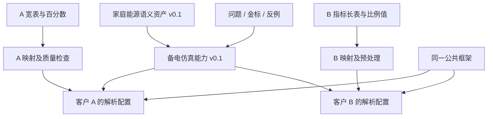

# Palantir 如何复用行业资产：官方文档调研与本项目取舍

调研日期：2026-09-23。范围：Palantir Foundry 的 Ontology、DevOps/Marketplace、接口、版本与验证机制。仅查询官方公开资料；没有登录 Foundry 或验证商业部署。下文将公开事实与针对本项目的建议分开，不据此推断 Palantir 内部全部 Git/客户交付政策。

## 1. 对当前问题的结论

建议借鉴的结构是：**可复用资产定义 → 版本化发布 → 客户输入绑定 → 独立安装/部署实例**。在我们工程里可先用普通文件、既有行业资产和客户 profile 表达，不能把它等同于“现在必须建插件市场或新增 npm 包”。

分支负责开发过程，客户实例负责配置与版本绑定。是否将某次定制独立维护，需要与是否继续接受公共资产升级一起决定。

## 2. 官方公开机制

### 2.1 Product、Version、Installation 是不同概念

Product 可以包含本体或本体片段、应用、数据管线、模型/业务逻辑。一个已发布版本能被多次安装，每次提供不同输入与环境配置。[DevOps 核心概念](https://www.palantir.com/docs/foundry/devops/core-concepts)

### 2.2 通过输入/输出划定共享边界

打包时，产品应提供的资源作为 outputs；安装方自行提供的数据或对象类型作为 inputs。DevOps 会分析所选资源的依赖，并将依赖纳入这套边界。[创建产品](https://www.palantir.com/docs/foundry/foundry-devops/create-products)

### 2.3 多种原始结构对齐公共语义

官方生态方案明确允许成员使用不同源系统和原始格式，在私有空间转换到共同业务模型，并复用接入管线模板。共享模型不等于强迫客户原始库采用同一物理结构。[多组织生态](https://www.palantir.com/docs/foundry/use-case-patterns/multi-organization-ecosystems)

### 2.4 用业务接口承载跨对象能力

Interfaces 表达可由多个对象类型实现的属性、关系和动作能力，让公共流程面向共同能力。[结构设计指导](https://www.palantir.com/docs/foundry/ontology/ontology-structural-guidance) 接口属性可区分必需/可选，由实现对象映射本地属性；必需关系/动作约束也需要满足。[创建接口](https://www.palantir.com/docs/foundry/interfaces/create-interface)

### 2.5 产品可以组合，但依赖需管理

Linked products 支持拆出公共上游并建立版本依赖，避免重复安装相同资源。文档也说明，链接基于具体资源关系，并非任意同形对象自动等价；破坏性变更需要调整下游并重新打包。[Linked products](https://www.palantir.com/docs/foundry/marketplace/linked-products)

### 2.6 分支用于隔离开发和审查合并

Ontology branching 覆盖隔离修改、rebase、冲突处理、proposal 和合并回 main，受保护资源也经该流程修改。[本体分支](https://www.palantir.com/docs/foundry/ontologies/branching-ontology) 这支持区分开发分支与客户安装，但不足以断言其内部没有长期客户分支。

### 2.7 定制副本有明确升级代价

安装可以锁定以避免直接编辑，也可以解锁后定制；文档明确指出安装内容的本地修改可能被升级覆盖。Detach 则断开该资源与 Marketplace 的管理联系。[安装与锁定](https://www.palantir.com/docs/foundry/marketplace/installations)

升级时若有新增必填输入或校验错误，需要处理后继续；自动升级文档标为 Beta，不能将升级能力理解为任意定制都自动兼容。[升级机制](https://www.palantir.com/docs/foundry/marketplace/upgrades)

### 2.8 复用定义与复用真实实例不同

对象类型、链接、共享属性和接口可打包；文档说明对象实例本身及 Action 对实例的编辑不随这种打包分发。不过数据集可另行作为资源提供，不能由此推导“产品绝不带数据”。[本体资源打包](https://www.palantir.com/docs/foundry/object-link-types/marketplace-ontology-types)

### 2.9 模型围绕业务形成，并保持可扩展

其设计指导要求模型表达现实业务实体，避免机械复制源表结构；稳定的核心可通过关联类型、接口等扩展，减少客户需求不断修改公共模型。[本体最佳实践](https://www.palantir.com/docs/foundry/ontology/ontology-best-practices)

### 2.10 验证以业务问题为核心

官方方法让参与者回答未预先演练的问题，观察正确性、耗时与调查路径，再比较人和 Agent 的表现；专门为某题制作的应用可能掩盖本体缺陷。[本体验证](https://www.palantir.com/docs/foundry/ontology/ontology-design-validation)

## 3. 对我们设计的推导

本节是建议，不是 Palantir 的原样架构或字段定义。

### 3.1 保留四个可独立演进的部分

| 部分 | 家庭能源示例 | 复用方式 |
|---|---|---|
| 公共框架 | controller、gateway、查询、核验、证据、预算 | 统一维护，不复制进每份行业资产 |
| 行业/子域资产 | 电池/测点/观测、单位、身份、关系、规则与评测 | 用稳定标识和版本引用，先覆盖家庭储能明确范围 |
| 场景能力 | 备电比较、候选策略、仿真结果视图 | 引用行业资产和计算 handler，可从普通模块开始 |
| 客户安装配置 | 数据来源、schema/mapping、设备参数、权限、模型与运行时选择 | 每客户独立绑定，共用上游版本；不借分支名表达配置 |

这些是职责与生命周期，不要求四个新代码包或四套服务。现有 IndustryPackExportBundle、ProfileSpec、ResolvedProfile 和升级服务已经覆盖部分表达，应优先沿用。

### 3.2 数据结构适配与业务接口分成两层

- **数据映射**解决客户的表列、JSON 路径、主键、编码、单位、时区怎样对应业务字段。
- **业务能力契约**解决不同类型是否具备某项流程所需的属性、关系与操作，哪些输入可缺省、缺省时能力如何降级。

第二层与 TypeScript 的数据库端口、MCP 工具协议不是同一层。只有跨对象复用需求已明确时，再扩展本体接口表达；不要先造一个包含所有行业字段的巨大 Entity。

例如储能算法所需的容量、可用电量、功率限制和效率应有清楚契约。不同厂家字段可以经确认映射满足它；某客户缺少效率参数时，不能仅因成功连接数据库就显示“可计算”。这一例子属于本项目建议。

### 3.3 两个客户应形成两个实例

这是建议结构。应先确认 A/B 指标含义相同，再转换尺度。新版本发布后分别预检 A/B；旧运行仍固定旧语义、规则、映射与证据版本。客户差异通常通过绑定和显式扩展保留，不直接修改共用定义。

客户长期脱离公共升级体系时，可保留独立交付线，但需记录来自哪个资产版本、哪些差异由谁维护；不能同时承诺无限制修改和零成本升级。

## 4. 如何形成可积累资产

我建议一份预览资产至少交付：

1. 业务范围、非适用范围、定义及来源；区分标准、领域判断、客户约定和实验假设。
2. 必需/可选输入契约、参数、能力要求和来源无关的映射模板。
3. 可引用的任务/规则/计算模块和必要界面；公共部分只有一份权威定义。
4. 已确认的预期答案与支撑关系、数据缺口、冲突、例外、撤回和 schema 变化用例。
5. 版本、摘要、依赖、维护负责人、变更说明及已验证的数据形态。

交付循环为：项目内发现需求 → 记录可复用候选 → 分离客户绑定 → 两种数据结构验证 → 发布可引用版本 → 新项目复用 → 失败案例回归。真实客户数据与身份裁决保留租户作用域，合成或允许共享的样例用于共同评测。

当前随包 PackTestCase 主要检查 expectedCapabilities/expectedStatus，宜补充对现有业务/语义金标的版本引用。装配成功、业务正确、客户验收应分别记录；把 maturity 改成 stable 不能替代证据。

## 5. 当前不照搬的部分

Foundry 的 Ontology 后端包含对象索引、对象存储/查询、写入编排和 Actions 等服务，并不仅是问答时多读取一份 schema。[Ontology 后端架构](https://www.palantir.com/docs/foundry/object-backend/overview)

基于我们当前范围，建议保持模块化单体、DataOS 作为数据中台，以及可选本体的直接查询/RAG 路径。借鉴资产与安装的分离，不等于复制其对象存储、微服务规模或立即开放真实设备 Actions。

这次资料也不能证明 Palantir 具备我们理论文档中的全部派生事实、例外、撤回和双时间语义；这些仍需我们自己的契约与回归验证。官方产品存在功能/版本限制，不能把“支持打包”解释为所有资源无条件可移植。

## 6. 最小下一步

在既有正确性修复推进的同时，先整理一份家庭储能预览资产与 A/B 两种数据结构验证集；用现有 profile 表达两个实例。检查哪些定义/算法可共享、哪些必须参数化、哪些应拒绝。

验收重点：同语义换结构不改核心；缺必需能力明确失败；升级可识别受影响实例；同一业务问题返回正确且可解释的证据；客户定制不会静默改变其他客户的含义。通过这些验证后，再决定独立包、资产目录界面或跨行业业务接口的下一步投入。

与[多行业方案](../scenario-decoupling-2026-09-23.md)共同使用。本文只形成调研依据和建议，没有实施框架变更或调用模型/设备。
