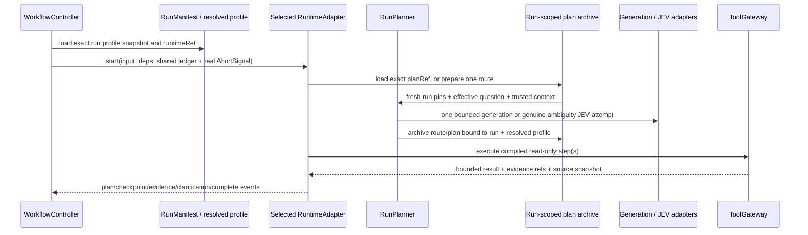

# Core planning and runtime wiring (2026-09-29)

This note maps [SPEC §6.2](../../tasks/spec-main-core-product-2026-09-28.md) and A11 to the current host, using [acceptance §8.4](../../tasks/acceptance-main-core-product-2026-09-28.md) for state and usage ownership. It identifies the smallest seams needed to run the planner in a normal Core request. It is a design record, not evidence that the model path is already connected or externally validated. Source links target the inspected 2026-09-29 working-tree snapshot.

## Current path and binding facts

`WorkflowController` owns the workflow phase machine. During collection it creates the run's `AbortController`, constructs `RuntimeInput`, calls `RuntimeCapabilityFactoryPort.forRun` with the real run id, resolved profile snapshot, runtime ref, shared ledger id, and signal, then calls exactly the adapter selected for that run. Tool calls go through that adapter's injected gateway. The controller remains the only owner of run phases, publication, and the shared run budget. See [controller collection and capability construction](../packages/application/src/workflow/controller.ts) and [runtime capability contract](../packages/contracts/src/workflow.ts).

The immutable runtime choice comes from the profile binding: `RunService.createRun` stores `binding.runtimeRef` in the run, and the controller selects by that exact reference. The UI also submits `preferences.route` (`auto`, `template`, or `pi`), but that value is currently stored as a preference; it does not override the profile's `runtimeRef`. A route preference must never silently change the adapter or checkpoint format. To use Pi, publish/preflight/activate a profile version that pins its exact runtime and compatible model/tool bindings, then create a run against that version. The present Core host only registers/selects `runtime-template@1.0.0`; it rejects another runtime ref. See [run creation](../packages/application/src/runs/service.ts), [runtime selection](../packages/application/src/workflow/controller.ts), and [Core runtime registration](../apps/api/src/composition/core-local-composition.ts).

`ProfileSpec` already carries the needed immutable inputs: `industryRef`, `mappingRefs`, `runtimeRef`, `backendBindings`, `modelBindings`, `toolBindings`, `computeBindings`, and `policyRef`. For a run, composition must re-read the `ResolvedProfile` by `run.profileRef` plus `run.resolvedProfileHash` and use that record's actual refs. It must not substitute the example scenario's base profile, another active version, or a deployment-wide mapping. `modelBindings.generation` and `modelBindings.decision` pin the model refs and fallback policies; server environment supplies endpoint credentials/configuration, not a replacement model identity. Tool bindings and resolved backends remain the authorization boundary for `data_query` and `document_search`.

Current Core's profile builder sets `modelBindings: {}` and enables only `ontology_lookup`; its `CoreFactsPlanResolver` ignores `planRef`, accepts only registered `facts:<attribute>` questions, and regenerates a deterministic facts plan from the run. `RuntimeInput.planRef` is optional and the controller currently leaves it unset. `TemplatePlanResolver.resolve` receives only `(planRef, ctx)`, so it cannot see the effective question, runtime dependencies, or the real cancellation signal. Consequently, `RunPlanner` is currently an exported application service, not part of the normal request path. See [Core facts resolver/profile](../apps/api/src/composition/core-local-composition.ts), [template resolver port](../packages/adapters/runtime-template/src/types.ts), and [RuntimeInput](../packages/contracts/src/generated/contracts.ts).

## One bounded route, then one selected runtime

Use one planning prelude for a collection start, not another agent or controller loop. The prelude reads the canonical run question (or the persisted rewrite), confirmed context, trusted `ToolContext`, and exact resolved profile pins. It receives the already-open run's `GenerationPort`, `DecisionPort`, and real `AbortSignal`; each actual provider attempt remains billed by the adapter against the one `budgetLedgerId`. The planner itself must not reserve a second budget. It compiles semantic plans through the existing `SemanticQueryCompilerPort` and never accepts model-produced SQL.

The narrowest current insertion point for the template path is the existing `TemplatePlanResolver`: extend this adapter-local port so `resolve` receives the `RuntimeInput` and `RuntimeDependencies` along with `planRef` and trusted context. The runtime already has all of these when `start` or `resume` is called. When `planRef` is present, the resolver loads that exact, authorized archived plan. When absent on a fresh start, it constructs a route from the run's exact resolved profile and returns either an archived executable plan or a typed clarification result. The runtime emits its existing `plan_proposed` / `clarification_requested` event forms and keeps the same `RuntimeAdapter.start` as the only collection entry point. This is a small change to the existing resolver seam, not a new generic plugin system. Pi requires its own adapter-local route prelude using its passed `RuntimeDependencies`; do not make a template run switch to Pi after a query result.

The plan archive must be scoped to tenant/space and bound to the canonical run id, resolved profile snapshot hash, exact `runtimeRef`, effective question/rewrite digest, selected definition and mapping refs, tool bindings, current input-manifest digest, and plan content digest. A route-level clarification resume also binds the exact typed response/revision; it must not collide with the pre-clarification route record. Persist the full immutable plan before executing a tool. The plan ref emitted in `plan_proposed` and saved in a runtime checkpoint must resolve to that same content and those same pins on resume. A repeated route-preparation request for identical bindings must recover the archived plan rather than generate a different one. If a provider attempt completed but no durable route receipt exists after a crash, fail closed and preserve its usage state; do not silently call the model again and pretend it was the original attempt.

The resolver's clarified outcome also needs a durable route checkpoint/receipt before the controller exposes a clarification. The durable worker currently requires a checkpoint when resuming a clarification action and fails with `recovery_checkpoint_missing` if none exists. Do not emit a pre-plan clarification and assume the old recovery path will reconstruct it. Either version the runtime checkpoint to record the route/clarification state, or add a narrowly scoped, idempotent route receipt that the same runtime can resume. On a missing-argument clarification inside an already planned template, resume the same archived plan and bind the typed value to that step; on a route-level clarification, re-evaluate only from the recorded response and current inputs. An existing executable plan/checkpoint is always resolved under the run's original runtime version; a new profile or runtime requires a new run. Keep old checkpoint payloads readable, and reject unsupported/cross-runtime checkpoints rather than reinterpreting them.

| Boundary | Reuse or addition | Contract needed |
| --- | --- | --- |
| Per-run collection capabilities | Reuse `RuntimeCapabilityFactoryPort.forRun`; it already receives the canonical run, resolved profile ref, exact runtime ref, one ledger id, and the controller's real signal. | Host must resolve enabled `generation`/`decision` model bindings by the run's `snapshotHash`; never fall back to environment defaults when the profile omits a binding. |
| Template route/plan preparation | Reuse the adapter-local `TemplatePlanResolver`; extend its request with `RuntimeInput` and `RuntimeDependencies` and return a discriminated plan-or-clarification result. | Its durable host backing must support an idempotent lookup for `(runId, profile snapshot, runtimeRef, input/clarification digest)` and an immutable save-if-absent for the full route/plan receipt. Keep this backing Core-local unless Pi needs the same store; do not add a generic plugin registry. |
| JEV actual route state | Reuse application `DecisionStateRefProvider` and the existing JEV adapter/resolver. | The archive must register the exact artifact ref for this run/profile before `DecisionPort.decide`; no synthetic hash refs or state authorization from tenant scope alone. |
| Semantic compilation and evidence calls | Reuse `SchemaVocabularyPort`, `SemanticQueryCompilerPort`, `ToolGateway`, and `RuntimeCheckpointPort`. | Compile against exact resolved mapping/definition refs; persist plan and runtime progress before relying on a restart. |
| Draft/verification model phases | Add narrow `WorkflowModelPhaseFactoryPort.forPhase` plus an internal per-call execution context for writer/verifier. | Inputs: run id, resolved profile/runtime refs, same `budgetLedgerId`, phase name, and fresh phase `AbortSignal`. Results: only authorized generation/decision ports and model refs. Deterministic implementations do not need the model capabilities. |

## Route behavior

| Input case | Required path | Model use and stop behavior |
| --- | --- | --- |
| Explicit registered task or published fixed plan | Build the literal, pinned plan and execute it through the selected runtime. | Zero generation/JEV calls. `scopeRef` is injected from trusted tenant/space context. An exact fixed task must bypass optional rewriting as well as JEV; `RunPlanner.route` currently invokes its optional rewriter before its fixed-plan branch. |
| Ordinary natural-language query | Build the bounded vocabulary from the run's resolved mappings and selected published definition; allow one `sql_proposer` proposal using only the `data_query` schema; compile it once into one read-only query step pinned to the exact mapping/source version. | A semantic plan is not SQL and is not an answer. Missing generation, empty vocabulary, or invalid proposal must produce an explicit unsupported/clarify or policy-declared deterministic outcome. It must not turn an arbitrary question into a definitions lookup. |
| Genuine route ambiguity | Only a concrete deterministic ambiguity may reach JEV. Archive and register the actual bounded state (question, route candidates, allowed tools, confirmed vocabulary and exact refs) for this run/profile before calling `DecisionPort`; use the existing [JEV route-state boundary](run-planner-route-state-2026-09-29.md). | JEV is optional and only chooses the declared route/clarify options. Missing decision/state capability uses an explicit fallback; invalid archive/authorization, budget, cancellation, deadline, or evidence failures remain failures. No probability is treated as answer correctness. |
| Follow-up evidence required after a tool result | Continue only inside the selected runtime's one collection loop, with the same run, signal, profile, and ledger. The runtime can request only profile-enabled tools and the host gateway revalidates every call. | Template currently executes its predeclared `PlanSpec`; it does not dynamically replan. Pi owns a model/tool loop, but the current Core host does not register it and Pi does not yet use `NoProgressGuard`. A template run cannot silently become a Pi run. Enable dynamic follow-up only for an explicitly bound runtime path whose single loop has a progress guard; otherwise ask for the missing input or stop explicitly. |

There are two concrete `RunPlanner` fixes required before host wiring can claim A11. In [`#proposeCandidate`](../packages/application/src/workflow/planning.ts), both a generation `event.type === 'error'` and a thrown error currently become `unavailable`; this can convert cancellation, deadline/budget denial, failed settlement/evidence archival, and other fatal errors into the ordinary default plan. Preserve the original classified error and propagate cancellation, budget/deadline, archive/evidence, and unclassified failures. Only a small documented allowlist of recoverable provider failures may use an explicit profile fallback. Separately, [`#defaultPlan`](../packages/application/src/workflow/planning.ts) currently builds `ontology_lookup` arguments with `intent` but omits its required `scopeRef`; inject the trusted `{ tenantId, spaceId }` from `ToolContext`. Keep any deterministic default limited to a question it actually answers.

`NoProgressGuard` is reusable, but it is not wired to either Core runtime today. It keys a call by tool, canonical arguments, and source/semantic version, and compares result snapshots/evidence/coverage. `SmallPlanExecutor` applies it to a fixed list of steps; it does not plan the next step. Template runtime executes its declared steps and Pi runtime's `beforeToolCall` currently checks only tool allowlist, cancellation, and budget. The selected dynamic runtime therefore needs one run-scoped guard at its own tool-call admission/result boundary. Persist the guard's bounded seen-call/result digests and counters in that runtime's checkpoint (or reconstruct them from a verifiable checkpoint) so resume cannot reset progress detection. Duplicate, empty, unchanged, round-limit, and budget stops must be explicit `NO_PROGRESS`/`BUDGET_EXHAUSTED` outcomes; a tool failure remains a failure, not an empty result. No controller-side second tool loop should be added.

## Budget, cancellation, evidence, and answer writing

The planner uses the existing generation/decision adapters with the run ledger and actual signal supplied by the host. It must not open/settle a second reservation. Each network model attempt reserves and settles once in its adapter; unknown provider usage remains `usage_unknown`. Gateway tool execution separately owns each tool reservation and its evidence/result recording. Cancellation during route preparation aborts the same signal, preserves the provider's usage outcome, and prevents a plan or late tool result from reviving the run. Archive, compiler, evidence, and accounting failures propagate; they are not converted into clarification or a definitions plan.

Drafting and verification need their own phase execution context before either gains model capability. Today the controller reserves a fixed `DRAFT_MODEL_TOKEN_ESTIMATE` of 64 for each draft attempt, calls `DraftWriterPort.writeDraft(request, ctx)` without a signal, then settles that reservation before calling `AnswerVerifierPort.verify(request, ctx)`, also without a signal. `DraftWriterRequest` has no model port/signal; `DraftVerificationService` stores its optional `DecisionPort` and model ref at construction. The controller's active abort map is populated only for collection, so `cancel()` and `abortActiveWork()` cannot cancel a writer or semantic review currently running. Core presently uses a deterministic writer and disables verifier semantic review; enabling a writer model or JEV verifier through static startup dependencies would leave this gap. The same principle applies if the optional preflight rewriter is enabled: it needs its own live phase signal before making a provider attempt.

Add one narrow `WorkflowModelPhaseFactoryPort.forPhase` rather than reusing a stale collection signal. Its input should be the canonical `runId`, exact `resolvedProfileRef`/`runtimeRef`, shared `budgetLedgerId`, phase (`rewriting`, `drafting`, or `verifying`), and a fresh controller-owned `AbortSignal`; its result contains only the phase's allowed generation/decision port plus the `ModelRef` read from that run's resolved profile bindings. The host re-reads the pinned `ResolvedProfile`, never an active/latest profile, and the adapter instances close over the same ledger and real signal. Thread that execution context as an internal per-call argument to `DraftWriterPort` and `AnswerVerifierPort` (or create narrowly scoped per-phase instances); deterministic implementations can ignore the model ports. The controller registers the phase signal in its active-work map, aborts it on user cancellation or lease loss, and checks the run state again after awaits before advancing/publishing.

Make accounting ownership explicit for draft generation. A deterministic typed writer has no model attempt. A model-backed writer uses adapter-owned accounting for each actual provider attempt, so the controller skips its fixed 64-token reservation/settlement for that writer; never reserve at both layers. Each JEV claim review is likewise a separate DecisionPort attempt settled by the decision adapter against the same run ledger. If an attempt may have reached a provider and usage is unknown, mark/retain `usage_unknown` and block further publication; do not release the controller's reservation as if the call were free. Hard verification always runs, and JEV semantic review remains optional and cannot override a hard failure.

The existing `PublishedFactsDraftWriter` is deliberately narrower than a general query answer writer: it accepts only complete `ontology_lookup` fact payloads and writes blocks that refer to typed claims/assertions. A successful `data_query` or `document_search` tool result is not by itself an answer. Core needs a separate typed evidence writer (a `DraftWriterPort` implementation, owned outside the host composition) that reads the run's authorized evidence artifacts and emits `answer-draft@2` claims/assertions with exact JSON-pointer bindings, source snapshot/result digests, field/object references, units/times, or exact document quote/locator digests. It must preserve decimal strings, `null`, unknown and incomplete coverage; unsupported payload types fail or produce a verified limitation. The existing hard verifier and publication gate remain mandatory, and host composition only selects/injects the writer. No free-form model prose is published.

The source boundary matters for query planning. Core currently creates a DuckDB snapshot from the checked-in example raw files at host startup. `createDuckDbSnapshot` currently JSON-parses every `scenario.rawSources` entry before it checks which sources are referenced by physical mappings. Adding an unstructured PDF/text source to that list therefore fails startup even when no SQL mapping references it. The next source-composition owner should build the SQL snapshot only from sources referenced by mounted physical mappings and carry document sources through a separate parser/index path; raw document bytes should not be constrained to the static-table JSON format.

Importing a new source/file into the job/artifact pipeline does not rematerialize or update those DuckDB relations. `data_query` can claim facts only from the physical sources and mappings actually mounted in that immutable query snapshot, with its returned source snapshot archived as evidence. A future import-to-query path needs a separately approved, versioned materialization/backend mount and matching profile mappings; the planner must not infer that “latest imported” means “queryable now.”

The Core host constructs a `PostgresKeywordIndexStore`, `Bm25DocumentSearchService`, and `document_search` handler, but it does not currently call `Bm25IndexBuilder.build/activate` or register an index-build stage. The active ingestion pipeline is parse → candidate extraction → validation → review handoff, and its outbox fallback only checks candidate counts. `createBm25IndexBuildHandler` exists, but its `parses` are a construction-time list; it is not wired to the actual parse records produced by a new job. Thus an enabled `document_search` binding does not prove an authorized collection has an active searchable generation, and a new import does not automatically become retrievable. A separate ingestion/index owner must resolve the authorized collection, build from the bounded parse records for that collection, persist/activate an immutable index generation through the durable job path, and expose its exact ref to the runtime. Until then, keep `document_search` disabled for that profile or return an explicit unavailable/incomplete result rather than treating an empty index as a successful retrieval. See [Core search assembly](../apps/api/src/composition/core-local-composition.ts), [current ingestion outbox](../apps/api/src/composition/core-local-composition.ts), and [index build handler input](../packages/adapters/search-bm25/src/index-build-stage.ts).

## Ownership and acceptance gates

| Owner | Smallest work boundary |
| --- | --- |
| `packages/application/src/workflow/planning.ts` | Preserve classified proposal errors; restrict deterministic fallback; add trusted `scopeRef`; bypass model work for exact fixed tasks. Keep one semantic proposal and one compile. |
| `packages/adapters/runtime-template` | Extend its existing resolver seam with the per-start `RuntimeInput` and `RuntimeDependencies`; load archived refs on resume; represent route clarification with a checkpointable, typed result. Preserve current checkpoint compatibility. |
| `apps/api/src/composition/core-local-composition.ts` | Construct the planner from the exact resolved profile, selected scenario definition, resolved mappings/tool bindings/model bindings, existing model capabilities, compiler/vocabulary, and run-scoped archive/state providers. Current fixed-facts resolver becomes one deterministic route, not the generic answer path. |
| Selected dynamic runtime (`runtime-pi` or a separately versioned same-runtime implementation) | Own the only follow-up evidence loop, use the injected signal/gateway/shared ledger, restore progress-guard state, and stop on no progress. Do not switch from the run's pinned `runtimeRef`. |
| Separate typed draft-writer module | Convert authorized `data_query` and `document_search` evidence into verifier-bound claims/assertions. Core host only wires it. |
| Workflow model phase owner | Add per-draft/per-verification model capability creation with the exact profile refs, same ledger, fresh cancel signal, and one accounting owner per actual attempt. Include phase signals in cancel/lease-loss handling. |
| Host/store/checkpoint owner | Persist scoped immutable route/plan receipts and full plan refs; bind them to run/profile/runtime and restore them through the exact runtime checkpoint. No plan archive may be replaced by a question hash. |

Before calling A11 complete, test the real Core HTTP/Controller path with a controlled local model endpoint and the same Postgres-backed run/profile/dispatch stores. The tests should prove: (1) a fixed task makes zero model calls and its scope is trusted; (2) an ordinary NL request reaches generation, emits one semantic `data_query` candidate, compiles once against the active mapping and executes through the real gateway; (3) actual route state and full artifact ref are registered before a genuine-ambiguity JEV request; (4) a selected dynamic runtime performs a useful second retrieval only after new information and the same exact call is stopped as `NO_PROGRESS`; (5) every rewrite/generation/JEV/tool/draft attempt is accounted once; cancellation during collection, rewrite, draft writing, or semantic review reaches the current port, while model fatal error, archive/evidence failure, budget denial, and expiry cannot become a successful default; (6) clarification and process restart restore the same runtime/profile/plan/checkpoint; and (7) `data_query`/document evidence becomes a typed draft that passes hard verification before the persisted answer body is visible. Keep the existing industry facts as deterministic regressions.

Current module/unit and controlled HTTP tests do not establish external model quality or real customer-data quality. No external model endpoint or customer source was used for this design. Until the normal HTTP + PostgreSQL path proves the gates above, report A11 as partially wired, not complete.
