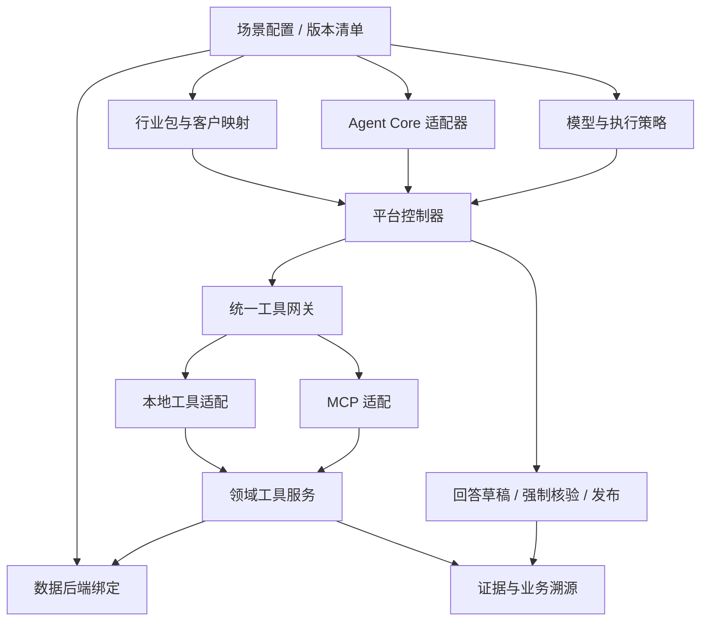
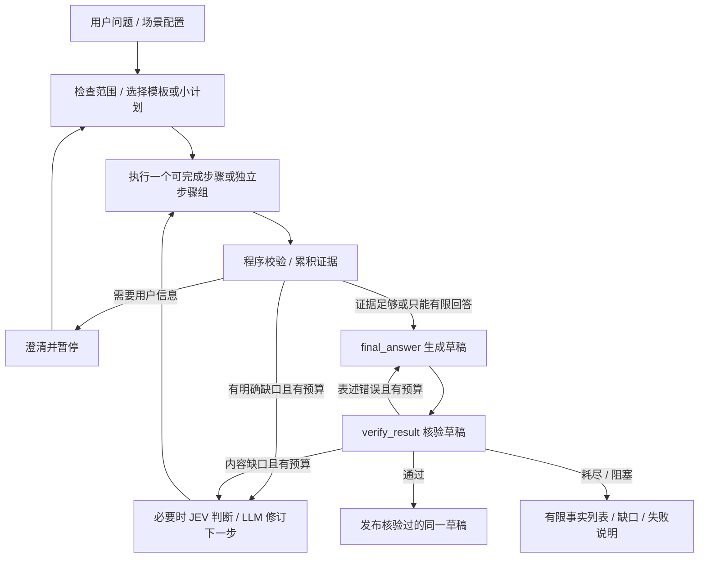

# PRD v0.2：可组合的行业语义与业务问答平台

日期：2026-09-21｜状态：评审稿｜前版：[PRD v0.1](prd-industry-semantic-agent.md)

首场景更新（2026-09-21）：用户确定以 Anker 黑客松的家庭充电储能为第一场景。见[家庭能源场景补充](scenario-home-energy-hackathon.md)。通用平台契约仍有效；调度仿真、真实设备执行与工具目录扩展单独评审，不能视为现有只读范围已包含。

用户已接受上一轮流程精简建议，并补充 TypeScript 可用、工具本地/MCP 接入及行业包/运行时/数据库解耦需求。本稿固化这些方向；尚未授权启动新版实现、数据库变更、模型调用或部署。工程和验收以本稿及对应 SPEC 为准。

独立建设约定（2026-09-21）：历史演示原型不是实现基线、兼容目标或验收金标；不要求复用其代码/接口/数据库/页面，不安排演示数据迁移。新测试根据当前业务语义和接口契约独立构造，不能将原型输出视为必须保持的行为。

## 1. 概述与版本决策

### 1.1 产品形态

提供可按场景组装的业务问答平台：接入客户数据，准备可查询数据及可选本体语义，由概率决策模型和生成式 LLM 协作，在固定工具目录内查询、计算、补查，最后通过强制核验与统一回答出口交付有来源的结果。

可沉淀资产包含行业定义、术语、身份与消歧策略、关系/规则、映射模板、工具契约、查询场景、评测集及运行策略。本体辅助可以开启或关闭；无本体时仍支持直接结构化查询、文档 RAG 和按权限启用的 Web 搜索。

DataOS 仅作为数据中台处理；不假定其抽取、消歧和推理模块可用。不要求所有数据搬入新库、所有文档向量化或所有规则结果物化。

### 1.2 相对 v0.1 的明确调整

| 编号 | 已接受方向 | v0.2 约定 |
|---|---|---|
| D1 | 固定工具且不能跳过核验 | 四个模型可选数据工具；回答生成、核验、发布由控制器强制调度 |
| D2 | 计划与 loop 结合 | 简单问题直出；已知依赖按小计划执行；未知依赖使用有界循环 |
| D3 | 精简重复模型判断 | 不默认多计划竞争、不每步调用 JEV；关键不确定点才评分 |
| D4 | 校验最终内容 | 工具结果先做程序检查；回答草稿完成后核验；通过的同一草稿才发布 |
| D5 | 存储与物化按需 | 复用可查询后端，数据迁移、向量索引与派生物化分别触发 |
| D6 | 控制首行业范围 | 首先验证家庭充电储能；交通政务/其他能源场景/医疗/汽车准备边界与契约 |
| D7 | TypeScript 可用 | 平台应用层以 TypeScript 为首选；首个动态运行时优先评估 Pi Agent Core，框架藏在适配器后 |
| D8 | 行业/运行时/数据库可挂载 | 用版本化场景配置组合，执行前检查兼容性；不修改平台主流程代码即可选择已支持的组合 |
| D9 | 内置与 MCP | 同一工具实现提供本地注册与 MCP 适配，避免两套业务逻辑；协议不能替代控制流程 |

### 1.3 目标与非目标

目标：正确找到业务数据；区分术语/实体/时态；提供可追溯答案；验证本体与路由的实际收益；降低新场景接入与维护成本；在数据量未知时保留扩展路径。

首版不做完整数据中台、自部署模型、所有行业全自动建模、任意工具动态注册、业务系统写操作、递归推理或通用 OWL 引擎。不承诺全局最优或无限容量。挂载不等于即时安装未知插件，不承诺运行中无缝更换内核或自动迁移数据库。

## 2. 用户、场景与行业资产

| 用户 | 主要操作 |
|---|---|
| 业务用户 | 提问、澄清口径、查看结果/来源、导出回答 |
| 交付工程师 | 配置场景、数据源与映射，查看后台任务和错误 |
| 领域建模人员 | 维护行业模型/身份策略/规则，审核抽取候选 |
| 平台维护人员 | 注册可信适配器，配置版本、权限、预算、模型 |
| 评测人员 | 比较不同路径和组合的正确性、时延、成本与复用效果 |

### 2.1 行业包路线

| 行业包 | 首选子场景 | 本期深度 |
|---|---|---|
| 能源：家庭充电储能 | 家庭光储/负载/电价/天气/备电的状态查询、解释、调度计划与仿真 | 用户已确认首场景；按黑客松资料与设备资源收敛范围，执行扩展另见补充 |
| 政府交通政务 | 服务事项、办理情形、材料、部门、地区、依据文件与版本的查询/核对 | 保留后续行业方向，先准备契约 |
| 能源工业其他场景 | 逻辑设备、物理资产、位置、安装、故障和维修 | 后续扩展，先准备身份/时间语义与映射 |
| 医疗 | 科室、预约、排班和非临床服务资料 | 仅准备标准/术语索引、范围与接口；诊疗不进入本期 |
| 汽车 | 车辆、车型、部件适配、维修资料与版本 | 仅准备定义、身份区分与问题；车控不进入本期 |

政府交通政务与能源工业仍是用户主方向；首切片已由用户明确为家庭充电储能，不再沿用原交通政务首包建议。其他包和全部适配器的实现不作为黑客松演示的前置要求。

### 2.2 包的内容与层次

行业核心模型 → 场景扩展 → 客户扩展 → 数据映射。包内包含稳定标识/版本、定义与反例、单位和指标口径、关系及基数、身份范围/别名策略、时态、规则、标准出处、查询能力、映射模板、示例和测试。客户实例与私有裁决默认不进入共享包。

同名业务概念若含义不同不能强行合并；共享接口表达共同能力。能源中的逻辑设备位置与物理资产分别定义，安装关系带时间。交通政务中的事项版本、地区和办理情形不能因名称相同就合并。

行业包只声明需要什么能力，不绑定某个 Agent SDK、数据库产品、连接地址或密钥。数据字段映射与企业特有口径保持独立。成熟度统一标为 `defined`、`experimental`、`validated`、`deprecated`，不得将准备材料标成已验证能力。

## 3. 可组合架构与挂载契约

### 3.1 模块职责

| 模块 | 声明/输入 | 提供的能力 | 不负责 |
|---|---|---|---|
| IndustryPackage | 包版本、领域定义、约束、所需能力、测试 | 业务语义与映射契约 | SDK、连接凭据、客户实例共享 |
| AgentRuntimeAdapter | 运行输入、上下文引用、工具目录、策略 | 开始、继续、取消、事件与检查点 | 绕过核验、直接访问数据库、维护行业真值 |
| DataBackendAdapter | 连接引用、来源映射、能力声明 | 目录/结构发现、只读查询/检索、分页、可得版本信息 | 决定业务概念含义、LLM 自由规划 |
| ToolService + Gateway | 工具 ID/版本、输入输出、可信执行上下文 | 验参、授权、预算、执行和证据登记 | 任意扩大工具集或权限 |
| ModelAdapter | 公司 API 配置引用、角色、能力声明 | 生成式调用或 JEV 类型化决策 | 保存明文密钥到行业包或 prompt |
| WorkflowController | 场景快照、运行状态、证据引用 | 外层阶段、强制核验、预算与最终发布 | 用自由文本代替审计与事实存储 |

### 3.2 场景配置

交付人员通过配置选择行业包、客户映射、运行时、结构化/文档数据绑定、生成模型、JEV 策略、工具传输与预算；业务用户只选择部署允许的场景，不需要理解底层框架。

配置字段示意（产品契约，不是已实现配置格式）：`profile_id/version`、`industry_package/version`、`mapping_version`、`runtime_id/version`、`data_bindings`、`model_bindings`、`tool_bindings`、`policy_version`。一个场景可同时绑定 SQL 后端和文档检索后端，不是整个应用只能选一种库。

启动前根据运行时、后端、工具授权和策略确定有效能力，再检查行业/场景的必需能力是否被完整满足。不得通过取交集悄悄丢掉必需能力。不兼容时列出缺失能力；仅在配置允许且明确展示降级时继续。不能把缺失向量检索伪装成已完成 RAG，也不能把普通查询标成本体推理。

每次运行固定版本清单、工具白名单和来源绑定。升级/切换默认影响新运行；旧运行以原清单继续。跨运行时检查点不假定可互换：不支持迁移时返回明确错误，允许重新发起，而非悄悄重放已完成步骤。

插件有版本、输入输出契约、能力清单与兼容范围。行业包挂载不自动安装代码或增加工具。卸载不能删除客户数据、历史证据或破坏活跃运行；数据库切换需要可用数据与映射，不能只换驱动名就宣称完成迁移。

### 3.3 TypeScript 与首个 Agent Core

TypeScript 作为平台应用层首选。Pi Agent Core 是首个动态 runtime adapter 的候选实现；具体版本在技术方案中锁定，并验证公司模型 API、工具调用、停止/取消、恢复与事件钩子。框架选择不侵入行业包和工具契约。

首版同时提供轻量模板执行适配器：适用于步骤已知的单次查询或固定计划，复用同一网关和证据协议。它用于实际简单场景和验证运行时可替换性，不要求同时实现第二套重型框架。LangGraph、DeepAgents 等后续按能力需要增加适配器，未通过兼容测试前不标可用。

策略和内核分开：单步、计划执行和自适应循环是运行策略，同一内核可支持多个策略，不因问题稍复杂就更换框架。各实现按当前契约独立设计；解析/计算 Worker 可按任务需要选择语言，不因历史实验技术栈而受限。

## 4. 工具：本地内置还是 MCP

### 4.1 决策

两种接入方式共用领域实现与契约：默认本地注册到 Agent 的工具目录；跨进程、远程服务、低代码或外部 Agent 集成时经 MCP 暴露/调用。所谓“内置”是由适配器注册，不把业务逻辑写死在 Agent Core 中。

MCP 负责工具发现、调用和结果传递；不会自动提供我们的业务权限、预算、真实性保证或强制核验。协议中可用 JSON Schema 和结构化结果表达契约，具体协商版本在 SPEC 中锁定。[MCP 工具规范](https://modelcontextprotocol.io/specification/2025-06-18/server/tools)

本地与 MCP 路径保持同样的输入语义、结果状态、错误、权限和证据 ID。默认本地直调，避免每次调用必经网络；需要隔离的工具才作为远程服务。输入/输出传输可以不同，语义不能漂移。

### 4.2 四个模型可选工具

| 工具 | 能力 | 边界 |
|---|---|---|
| `ontology_lookup` | 获取局部定义、指标、关系、实体映射、规则与派生事实信息 | 分页/限范围，返回语义和映射版本，不加载全本体 |
| `data_query` | direct/semantic 查询、受限聚合和规则求值 | 底层按方言与能力编译执行；不开放任意代码/写 SQL |
| `document_search` | 关键词/向量/混合检索 | 返回片段、来源、时效与截断信息；不自作最终回答 |
| `web_search` | 检索允许的公开外部资料 | 按场景启用；不自动外发客户私有数据，不覆盖内部事实 |

部署可启用目录的子集。模型不能自行增加工具；MCP 服务即使发现更多工具，也只按注册映射和白名单暴露上述能力。需要扩目录时发布新版本，而非运行时自动接纳。规则求值属于受控数据计算子能力，不要求额外自由工具。

### 4.3 强制阶段与外部使用

`final_answer` 保留为回答生成服务接口，负责产生草稿；`verify_result` 保留为核验服务接口。它们由 WorkflowController 调度，不是由模型决定是否执行的可选检索工具。

内部完整链路必须经过核验才向用户发布回答正文。外部客户端只调用四个 MCP 数据工具时，获得的是数据/证据服务，不自动享有“答案已核验”保证。未来若提供完整问答服务，它应是单独的受控工作流入口，不混入四个检索工具并让内部 Agent 递归调用自己。

### 4.4 传输与身份

本地进程型 MCP 可选 stdio；远程服务可选 Streamable HTTP。传输选择不改变业务契约；协议版本与认证方案在 SPEC 确认。[MCP 传输规范](https://modelcontextprotocol.io/specification/2025-06-18/basic/transports)

租户/用户权限由可信会话或服务凭证解析，不信任模型参数内自报身份。所有路径在服务端执行范围过滤。保留 run/step/tool-call 关联 ID；超时、取消、分页、过期和工具错误不能被转换成“无数据”。大结果存为受权限控制的引用，模型只接收有界摘要及继续获取方式。

## 5. 后台数据与行业语义流程

### 5.1 数据接入与后端选择

接入→来源版本登记→质量检查→必要预处理→可查询数据。已满足要求的客户库直接只读访问；只有性能、治理或更新需求明确时才迁移/复制。

| 后端角色 | 可选实现 | 必须声明的差异 |
|---|---|---|
| 结构化查询 | StarRocks、客户关系库或 DataOS 查询接口 | 方言、分页、只读约束、快照/时间查询、扫描限制 |
| 历史湖表 | Iceberg + 对象存储 + 实际查询引擎 | Iceberg 是表格式，不单独执行查询；引擎及快照能力另行声明 |
| 文档检索 | 关键词检索、Milvus 等向量后端或混合实现 | embedding 版本、过滤能力、分页与来源定位；向量库不是完整 RAG |
| 控制与溯源 | 事务型控制存储，SPEC 选型 | 与业务后端解耦，行业包/业务库切换不丢审计与证据 |

数据库适配不要求所有后端运行同一段 SQL。跨后端查询采用明确的联合执行计划、连接键和预算；不支持或过大时说明限制，不能无界拉取全表到 Agent 上下文。

### 5.2 本体抽取与消歧

行业核心定义优先来自行业资料和确认的语义契约。客户数据接入时抽取实例、关系、规则和映射候选；只有确有新概念时提出 schema 扩展，不每次重新生成行业模型。

解析保留原始文件、页码/位置、版本和必要章节上下文。规则候选保留条件、否定、例外、单位和适用范围。格式、类型、来源验证与语义审核分开；候选通过发布策略后才进入正式计算。

结构化强标识先走确定性对齐；文档提及或跨源歧义走范围过滤、候选召回、证据判定及澄清。名称相似不直接等于同一，未召回不证明不存在。术语口径澄清与实体匹配分别记录。

高影响合并和判定规则首版需要审核；稳定低风险类型可配置自动发布。保留匹配、新建待确认、拒绝和澄清结果及版本。文档复制件不重复计为独立证据。

### 5.3 规则求值与物化

规则先支持按需计算；重复查询、计算成本或时效需求触发物化。物化器仍是目标能力，首版至少验证一个变更驱动的有限规则场景，不要求预计算所有规则。

推导记录 AND 前提组、OR 替代支撑、规则版本、有效时间和记录版本。新增/修订/撤回触发受影响范围重评；最后支撑消失的结果不再被当作当前有效事实，替代支撑有效则保留。后台处理中显式标记旧结果过期或不可用。历史保留，不把当前失效误写成“历史上从未成立”。

### 5.4 规模与任务

异步任务使用阶段检查点和幂等发布；解析、模型调用与数据库写入各自限流。候选范围、上下文、查询扫描、工具输出与证据展开均受预算控制，截断必须可见。模型重试可能产生不同候选，应保留版本并防止重复发布。

本系统按范围查询、维护投影和依赖索引，使用历史检查点；证据支撑避免无界组合枚举。缓存包含客户范围、版本、时间与权限语义，更新可使其失效。具体方案通过本规格的容量与正确性验证选择，不继承旧实现结构。

记录页数、提及/实体/事实/规则/依据数、版本数、更新率、并发、扫描量和模型用量。具体容量与 SLO 由指定硬件、数据分布和模型配额下的测试确定，不以“文件数不限”作承诺。

## 6. 在线执行：小计划与有界循环

### 6.1 主流程

简单问题一次工具即可结束；关系多跳可由一次 SQL/确定性遍历完成，不要求每条边触发模型轮次。已知依赖用小计划执行，独立只读步骤可并发；下一步取决于新结果时进入循环。

WorkflowController 管外层阶段和共享预算；选定 RuntimeAdapter 管收集证据阶段的唯一策略循环。规划、工具和核验不得各自再开无界内部循环。补查回到同一运行上下文，不重置预算。

### 6.2 状态、停止与恢复

运行状态至少包含已确认实体/口径/时间、计划及修订、执行步骤、证据引用、缺口、剩余预算和停止原因。大型数据留在存储层，不把历史所有结果重复塞给模型。

停止条件：证据足够；需要澄清；不支持/无权限；预算耗尽；重复步骤且没有新信息；用户取消。相同工具/规范化参数/数据版本的重复调用被识别，只有输入、版本或明确恢复条件变化才重试。对工具超时、无数据、未知、冲突分别编码。

暂停恢复保留输入版本和权限边界；恢复时重验权限与数据有效性。权限收回则停止；使用历史数据的结果标明版本，不静默切换为最新。事件流应可重放展示，不能把 SDK 内部消息等同业务证据。

### 6.3 JEV 与生成式模型

JEV 是概率决策模型，负责在预定义选项中做工具/意图分类或原子核验评分，不生成自由文本、SQL 或计划。生成式 LLM 负责抽取、SQL、小计划和回答；程序应用权限、约束和预算。[Jev 官方说明](https://docs.typesafe.ai/introduction)

固定路径或用户已明确的路由可跳过 JEV。常规复杂问题先给一个计划；只有存在实质备选或失败时才做多计划比较。不会每步重复执行“难度判断→规划→计划评分”。复杂度是辅助判断，不替代对当前缺口的观察。

保留 JEV 概率分布和调用版本，阈值按行业验证。服务不可用时进入配置的确定性路由/替代模型/澄清路径并标明降级；生成式模型自报分数不能伪装成 Jev 等价概率。所有模型通过公司 API 或经确认的服务接入，凭据只引用、不写入包和文档。

### 6.4 强制核验与回答

每次工具返回先执行参数/状态/范围/版本/截断等程序检查。证据就绪后由回答服务生成草稿；核验针对该草稿检查数值、单位、引用、结论覆盖和证据支撑。复杂或高风险内容可按策略调用 JEV/模型做语义审查；确定性失败不能被模型高分覆盖。

核验结果：通过、需要补证据、需要澄清、冲突、阻塞。补查/修改受同一预算限制。通过后发布的是同一草稿或只改变排版的等价内容，不能再调用模型重写后直接发布。未通过草稿不作为最终答案实时流出；UI 可先流出进度、已验证事实或明确标记的状态。

普通结果可由模板呈现，不能为了统一出口强行多调用一次生成模型。有限回答必须标明覆盖范围和缺口。结构化统计追溯查询、过滤口径和可得快照；文档追溯位置与版本；派生结论追溯依据组。图展示可选，实际来源不可省略。

## 7. 用户故事与验收

下列故事继承 v0.1 产品范围并按挂载与执行边界重组；后续按实现仓库继续拆小。每个 UI 故事均包含浏览器验证。最后故事负责完整 E2E；不得把文档完成标记为功能完成。

### US-001：登记可信组件
作为维护人员，我希望注册版本化行业包、运行时和后端适配器，以供场景选择。
- [ ] 清单包含类型、版本、契约及能力；不合法组件不能显示为可用。
- [ ] 未注册代码不会因模型输出或 MCP 发现而自动加载。

### US-002：配置并预检场景组合
作为交付人员，我希望选择行业、运行时、后端和策略。
- [ ] 保存配置后显示解析后的版本清单及缺失能力；不兼容组合不能静默运行。
- [ ] UI 展示未配置/可用/降级原因；浏览器验证。

### US-003：行业核心与客户映射分离
作为建模人员，我希望两个来源结构共享业务语义。
- [ ] 两个地区/客户样例通过不同映射回答同一组核心业务问题。
- [ ] 企业扩展不改共享核心；旧版本可读，客户实例不进入共享包。

### US-004：首个动态 Agent RuntimeAdapter
作为开发者，我希望用 TypeScript 适配 Pi Agent Core 而不污染工具实现。
- [ ] 通过统一接口开始/继续/取消；事件和工具请求转换为平台契约。
- [ ] 所有工具调用经网关；SDK 自动最终消息不能绕过核验发布。

### US-005：模板执行器与运行时替换
作为交付人员，我希望简单任务可选模板执行器。
- [ ] 同一行业/工具/数据配置，切换模板执行器与动态运行时可完成各自支持的测试场景。
- [ ] 不支持的能力或跨内核恢复返回清楚错误；不修改行业包代码。

### US-006：本地工具注册
作为运行时使用者，我希望稳定调用四个数据工具。
- [ ] 输入输出、错误、取消和证据契约有自动测试；禁止目录外工具。
- [ ] 核验/回答接口不作为模型可绕过的可选检索工具。

### US-007：MCP 等价接入
作为外部集成者，我希望相同领域工具可通过 MCP 使用。
- [ ] 至少一个真实领域工具经本地与 MCP 两条路径，对同一输入和身份返回语义一致的结果/错误/证据；其余工具通过共用适配契约测试。
- [ ] 未授权发现项不暴露给模型；MCP 断开或出错不返回“无数据”。

### US-008：连接与能力发现
作为交付人员，我希望知道数据后端实际能做什么。
- [ ] 展示结构化查询、检索、分页及快照等已验证能力；连接失败不标就绪。
- [ ] 凭据不出现在 UI/模型上下文/导出包；浏览器验证。

### US-009：按需预处理并查询数据
作为业务用户，我希望原有可查询数据无需重复搬运。
- [ ] 原库直查与需要清洗的导入夹具均能返回正确结果及来源映射。
- [ ] 错误行可定位；重试不重复发布；不支持的跨库查询明确返回限制。

### US-010：解析文档并检索来源
作为业务用户，我希望找到带定位的文档证据。
- [ ] PDF/文本样例保留版本、位置和必要条款上下文；关键词/向量模式按实际能力报告。
- [ ] 命中可打开原文；解析失败与空检索分开显示；浏览器验证。

### US-011：后台任务恢复
作为交付人员，我希望中断不会丢进度或重复入库。
- [ ] 阶段状态、错误与重试可见；Worker 中断后从检查点恢复。
- [ ] 已发布结果不重复生成；浏览器验证任务界面。

### US-012：抽取实体与关系候选
作为建模人员，我希望候选具有可核对来源。
- [ ] 按行业契约输出对象/关系候选及版本，不擅自改 schema。
- [ ] 无来源或类型错误不能发布；直接标识可走确定性映射。

### US-013：抽取规则和例外
作为领域人员，我希望条件不因抽取而变宽松。
- [ ] 固定样例保留 AND/OR、否定、例外、数值、单位和适用范围。
- [ ] 未支持表达明确进入待处理，不静默发布简化规则。

### US-014：召回与裁决实体
作为审核人员，我希望确认同一实体或提出澄清。
- [ ] 覆盖稳定 ID、别名、同名跨域、历史版本和负例；范围外候选不可匹配。
- [ ] 匹配/新建待确认/拒绝/澄清保留依据和修订；浏览器验证。

### US-015：审核发布语义资产
作为建模人员，我希望候选和已发布事实明确分开。
- [ ] 对照来源审核；正式计算只用满足发布策略的版本。
- [ ] 发布前冲突可见，拒绝/修订留记录；浏览器验证。

### US-016：求值与选择性物化
作为业务用户，我希望规则结果可解释并可复用。
- [ ] AND 前提与 OR 支撑通过测试；未知/冲突不默认为 true。
- [ ] 同一受控规则按需计算与物化结果一致，记录规则/数据版本。

### US-017：变更、撤回与历史
作为维护人员，我希望错误依据不会污染当前结果。
- [ ] 一条支撑撤回后保留替代支撑；最后支撑失效后当前结果撤出。
- [ ] 处理中标记和旧版本回放正确；业务证据不依赖某个 SDK 检查点。

### US-018：路由与小计划
作为业务用户，我希望根据实际缺口选择路径。
- [ ] 固定路径可绕过 JEV，普通复杂题只生成一个小计划；记录必要决策概率与执行选择。
- [ ] JEV 不确定/不可用、工具未挂载和语义未覆盖均走明确策略，不能编造计划或能力。

### US-019：有界多步执行
作为业务用户，我希望跨来源查询能根据结果继续。
- [ ] 覆盖单次 SQL 多跳、已知依赖计划和结果驱动补查；独立只读步骤可并发。
- [ ] 重复无进展、超预算、用户取消和澄清均能停止/暂停；补查不重置预算。

### US-020：受控直接/语义/文档/Web 路径
作为业务用户，我希望按允许路径查数。
- [ ] 无本体可直查；语义模式记录实际使用版本；文档与 Web 来源可区分。
- [ ] 禁止联网/未授权字段/写 SQL 均被阻止；工具失败不同于业务“不满足”。

### US-021：草稿生成、核验与发布
作为业务用户，我希望最终看到的回答已经过核验。
- [ ] 单位错误、实体错配、无证据结论和失效来源被识别；程序失败不能被 JEV 高分覆盖。
- [ ] 核验通过才发布相同草稿；失败时有限补查/修订或降级，不泄露未经通过正文；浏览器验证。

### US-022：按需溯源与场景展示
作为业务用户，我希望看懂结果的依据和能力边界。
- [ ] 展开查询/事实/规则/原文与历史版本；权限过滤覆盖证据和导出。
- [ ] 大图分页/按需展开，明确是否使用本体及当前运行组合；浏览器验证。

### US-023：资产发布与组合升级
作为交付人员，我希望升级不破坏旧运行。
- [ ] 新行业/运行时/后端配置影响新运行，活跃运行保持版本清单；不支持升级返回原因。
- [ ] 包导出不包含客户实例/密钥，其他行业只定义准备材料并标成熟度。

### US-024：组合与路径评测
作为评测人员，我希望验证可挂载与路由收益。
- [ ] 同一组受控问题切换运行时、数据适配和工具传输，比较结果/证据语义与错误行为。
- [ ] 对直接/语义/检索/混合/Auto 测质量、P50/P95 时延和用量，保存模型与数据版本。

### US-025：完整产品 E2E
作为测试人员，我希望跨 UI、API、后台任务与数据层验证完整流程；依赖 US-001—US-024。
- [ ] 配置场景→接入/预处理→抽取/消歧/审核→发布→提问→工具执行→草稿核验→最终回答→打开溯源，自动断言实际路径。
- [ ] 覆盖一条依据撤回后更新、旧版本回放，以及至少一个澄清/权限/超时失败路径。
- [ ] 覆盖无本体路径、第二套来源映射、两个 runtime adapter 及本地/MCP 切换；禁止隐藏绕过统一网关。
- [ ] CI 使用可控模型响应，独立创建/清理数据；浏览器验证。真实模型质量评测另行执行，模拟测试不证明真实模型效果。

## 8. 功能要求

| 编号 | 系统必须具备的单项行为 | US |
|---|---|---|
| FR-1 | 系统必须验证注册组件的版本与能力声明。 | 001 |
| FR-2 | 系统必须在运行前校验场景组合兼容性。 | 002 |
| FR-3 | 系统必须为运行固定依赖版本清单。 | 002,023 |
| FR-4 | 系统必须分离行业核心与客户映射。 | 003 |
| FR-5 | 系统必须通过适配器接入 Agent Core。 | 004,005 |
| FR-6 | 系统必须让所有工具路径经过统一授权与预算检查。 | 006,007 |
| FR-7 | 系统必须限制模型只能选择四个目录内已启用数据工具。 | 006 |
| FR-8 | 系统必须保持本地与 MCP 调用的业务语义一致。 | 007 |
| FR-9 | 系统必须拒绝 MCP 动态发现带来的未授权能力扩张。 | 007 |
| FR-10 | 系统必须按后端能力执行或明确拒绝查询。 | 008,009 |
| FR-11 | 系统必须记录预处理结果的来源版本。 | 009 |
| FR-12 | 系统必须保存文档证据的稳定定位。 | 010 |
| FR-13 | 系统必须支持任务恢复与发布幂等。 | 011 |
| FR-14 | 系统必须隔离抽取候选与已发布数据。 | 012,015 |
| FR-15 | 系统必须保留规则候选中的例外与适用条件。 | 013 |
| FR-16 | 系统必须按范围和证据执行实体裁决。 | 014 |
| FR-17 | 系统必须允许无法确认的身份进入澄清状态。 | 014 |
| FR-18 | 系统必须为派生结果记录前提组和规则版本。 | 016 |
| FR-19 | 系统必须在依据变更后重评受影响推导。 | 017 |
| FR-20 | 系统必须阻止已失效旧结果被当作当前事实。 | 017 |
| FR-21 | 系统必须提供固定模板、小计划与自适应执行策略。 | 018,019 |
| FR-22 | 系统必须对整次运行共享同一预算。 | 019 |
| FR-23 | 系统必须检测重复无进展并停止。 | 019 |
| FR-24 | 系统必须支持取消和澄清后恢复。 | 019 |
| FR-25 | 系统必须允许无本体的直接数据访问。 | 020 |
| FR-26 | 系统必须遵守联网与只读权限策略。 | 020 |
| FR-27 | 系统必须通过控制器强制核验回答草稿。 | 021 |
| FR-28 | 系统必须发布经过核验的同一内容版本。 | 021 |
| FR-29 | 系统必须将核验失败转为有界修复或明确降级。 | 021 |
| FR-30 | 系统必须提供按需加载的真实证据链。 | 022 |
| FR-31 | 系统必须标明各行业包的成熟度。 | 023 |
| FR-32 | 系统必须保持旧运行不被新组合静默替换。 | 023 |
| FR-33 | 系统必须比较组合切换后的契约与结果行为。 | 024 |
| FR-34 | 系统必须通过跨层 E2E 验收。 | 025 |

## 9. 交互、质量与验收矩阵

界面包括场景配置、数据任务、行业模型/映射、候选审核、业务问答、证据/评测。技术配置面向交付人员；业务用户默认只看到可用场景和业务限制。所有 UI 状态区分未配置、就绪、处理中、过期、失败、空结果和权限不足。

可挂载验证不得只测加载成功：至少一个行业包配两套不同来源映射；一个任务在动态和模板运行时中分别完成；一个真实领域工具以本地/MCP 两种方式执行；两种可运行数据适配器各有支持范围测试。不要求不同数据库返回逐字一致的排序/格式，但相同口径下的业务结果与证据语义须一致。不兼容组合必须有负例。

首版至少一个结构化查询适配和一个文档检索适配真实可用；为证明同类后端可替换，另提供一个轻量本地结构化适配器或已有客户查询适配器，不能只用 mock 声称可挂载。MCP 首版先验证一种传输，其余标未验证。

质量分层统计：抽取条件/例外准确率和召回；消歧误合并/漏匹配/澄清率；查询与口径正确率；核验误放行/误阻止；证据支持率；过期结果暴露；行业迁移成本；时延/调用量。受控样例中的撤回、权限、引用完整性必须全部通过，不能推广为真实世界零错误。

大数据测试记录硬件、页数/实体/事实/依赖/历史规模、更新与并发、扫描量和模型配额。容量/SLO/成本阈值在 SPEC 和首轮基线中明确；本稿不编造性能保证。开发/保留评测按文档版本或来源客户分离，合成机制测试与真实业务测试分别报告。

## 10. 分阶段交付

| 阶段 | 交付 | 退出条件 |
|---|---|---|
| M0 | TS 契约、场景清单、首行业范围、模型/后端能力核实 | 各模块边界和可用性明确，未知项不标已支持 |
| M1 | 动态+模板 runtime adapter、四工具网关、本地/MCP 最小适配、直接查询与强制回答核验 | 一个无需本体的完整闭环可运行，并证明适配切换 |
| M2 | 家庭能源行业包、设备/传感器映射、自动抽取/消歧/发布 | 同一行业契约跨来源使用，候选审核有效；黑客松切片按场景补充收敛 |
| M3 | 语义辅助查询、按需求值/物化、变更维护与历史 | 支撑撤回和时间版本验证通过 |
| M4 | 自适应多步、JEV 按需决策、Web 可选接入、规模与组合评测 | 有界执行、降级与全链 E2E 通过 |

权限、版本、来源、资源限制和恢复契约从 M1 开始，不在最后补。其他行业同步形成资产清单与问题集，但完整实现独立排期。确认本稿后再产出 SPEC 与 ready Issues，通过 poc-flow/loop-it 执行明确范围；当前仅文档交付。

## 11. 待评审与待核实

1. Pi Agent Core 作为首个 TS 动态适配器是工程推荐，需验证公司 API 和版本；替换它不改变平台契约。
2. 首个真实结构化后端、文档检索后端与 MCP 传输选择待确认；不把 StarRocks、Iceberg、Milvus 同时列为启动依赖。
3. 家庭储能首批设备/固件、Home Assistant 插件、数据、动作权限及赛题验收待核实；调度仿真/执行范围见场景补充，其他行业不阻塞首包。
4. JEV 接入地址、授权额度、概率字段和生成模型能力需在实际集成前核实；本稿不保存密钥。
5. 场景间可兼容范围、取消/恢复期限、数据保留与质量/性能阈值在 SPEC 明确；不承诺任意插件任意互换。

## 12. 依据与参考

- 用户已确认的 v0.1 评审调整与本轮三类挂载要求；最新用户修订优先于历史草案或实验结果。
- [推理理论 2.0](D:/database/工作项目/sources/项目/dataos/2026-09-15-推理层理论基础-2.0.md)、[消歧理论 v2](D:/database/工作项目/sources/项目/dataos/2026-09-10-非结构化真理源消歧理论方案v2-进阶版.md)：身份、证据、时态、支撑撤回的需求依据；理论主张仍需验证。
- [Pi Agent Core](https://github.com/earendil-works/pi/blob/main/packages/agent/README.md)：TS 运行时候选。适配器、控制器与行业包分层为本产品设计，不是 SDK 自动保证。
- [MCP Tools](https://modelcontextprotocol.io/specification/2025-06-18/server/tools)、[MCP Transports](https://modelcontextprotocol.io/specification/2025-06-18/basic/transports)：以公开版本作协议参考，集成时验证并锁定兼容版本。
- [Jev](https://docs.typesafe.ai/introduction)、[Confidence](https://docs.typesafe.ai/confidence)：概率决策角色与阈值使用参考，不把厂商宣传当作领域正确性证明。
- [Palantir 建模](https://www.palantir.com/docs/foundry/ontology/ontology-best-practices)、[业务验证](https://www.palantir.com/docs/foundry/ontology/ontology-design-validation)、[类型资源打包](https://www.palantir.com/docs/foundry/object-link-types/marketplace-ontology-types)：行业资产设计与验证参考。
- [Iceberg](https://iceberg.apache.org/)、[StarRocks](https://docs.starrocks.io/docs/introduction/Features/)、[Milvus](https://milvus.io/docs/overview.md)：不同数据存储/访问职责参考，选型不等于本稿已验证实现。
