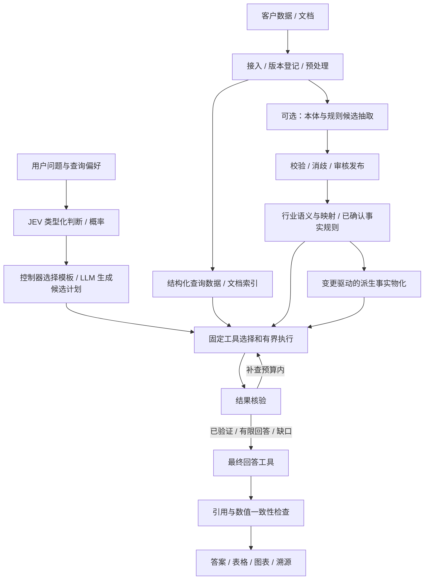

# PRD：行业语义驱动的多工具业务问答平台

版本：v0.1 历史草稿｜日期：2026-09-21｜状态：已由 [PRD v0.2](prd-industry-semantic-agent-v0.2.md) 及后续用户修订取代，不作为当前执行或兼容依据。

本文整合用户本轮五步产品定义，以及行业本体资产、自动抽取与消歧、业务数据查询、派生事实、溯源、规模扩展和固定工具编排的既有讨论。只包含产品与研发需求，不包含私人职业规划或同事评价。

## 1. 产品概述与流程判断

### 1.1 产品定位

面向企业/政务业务人员和交付小队的数据问答平台。接入结构化、半结构化和非结构化数据，形成可查询的数据与可选的行业本体语义层。用户提问后，JEV 对预定义决策问题输出概率/类型化决策，生成式 LLM 负责抽取、计划、SQL 和表达，确定性控制器依据约束选择固定工具，完成查询、必要的多步推理、结果核验、证据溯源与最终回答。

核心交付是正确找到业务数据、理解业务口径并生成有依据的答案。本体既是可调用的语义增强能力，也是可独立沉淀的行业资产；不是每次问答的强制步骤。行业不限于数广政策场景。

### 1.2 对用户五步流程的判断

整体符合此前讨论，需明确以下边界：

1. 数据接入、预处理、抽取、消歧、发布与物化属于持续的数据准备流程；在线问答消费其产物。
2. 本体抽取覆盖对象、属性、关系、身份、口径与规则；schema 候选、实例候选和规则候选分开处理。
3. 问题难度是执行计划的辅助信息，不能只依赖“简单/复杂”标签决定正确路径。
4. 最优解指在明确约束和预算下选择证据充分、成本与时延合理的可行答案；不宣称全局最优，不默认全工具并行跑一遍。
5. 输出校验由确定性检查与模型语义审查组合；模型不能自证正确。最终回答工具消费核验后的证据包，生成后还需执行引用、数值与输出状态一致性检查。

### 1.3 已确认与暂定条件

| 项目 | 当前约定 |
|---|---|
| DataOS | 仅作为数据中台；不依赖其本体建模、抽取、消歧或推理能力已经可用 |
| 数据规模 | 未确定；按可扩展接口、异步任务、局部查询和增量更新设计，不承诺未经测试的容量 |
| 模型 | 使用公司现有 API，首期不自部署模型 |
| 数据访问 | 数据库、文件或 DataOS 适配器；能力必须通过契约和验证确认 |
| 工具 | 在线工具集合固定，模型不能自行注册任意工具 |
| 本体 | 可选调用；核心模型、场景包、企业扩展和物理映射分层 |
| 测试依据 | 按当前规格定义事实、规则、依据、撤回与回放的预期行为；不从历史实验继承兼容义务 |
| JEV 职责 | 用户确认是非生成式决策模型。与描述一致的 TypeSafe Jev 官方能力已查阅；作为目标概率决策接入，实际公司 API 可用性与版本待核实 |
| 行业优先级 | 政府交通政务与能源工业为主，医疗和汽车为后续；四类行业均准备独立资产包边界 |
| A-02：首个场景 | 建议先做“交通政务服务事项与材料查询/核对”，范围小于完整政务行业；能源工业设备维护为第二验证方向。细分选择待本稿评审 |
| A-03：连接器 | v1 至少交付一种实际可用的结构化查询后端、一种文档检索后端和一种 Web 搜索接入；具体产品待技术方案确定 |

### 1.4 两条工作流

## 2. 目标与用户

### 2.1 产品目标

- G1：让用户在授权数据范围内，通过自然语言获得可验证的业务数据与解释。
- G2：支持直接 Text2SQL、本体语义辅助 Text2SQL、文档 RAG、Web 搜索及它们的组合路径。
- G3：使行业模型、身份规则、映射模板、查询能力与评测集能够跨企业复用。
- G4：明确区分来源事实、派生结论、推测、缺失、冲突与工具失败。
- G5：数据更新后能识别受影响结果，避免失效证据继续被当成最新依据。
- G6：记录质量、成本、时延及人工介入量，以测试数据检验自动路由的价值。

### 2.2 用户角色

| 用户 | 主要任务 |
|---|---|
| 业务用户 | 提问、澄清口径、查看数据、核对来源、导出结果 |
| 交付工程师 | 接入数据、配置映射、查看任务失败和质量问题 |
| 领域建模人员 | 维护行业模型、规则、术语与消歧策略，审核候选 |
| 平台维护人员 | 配置模型/工具/权限/预算，发布版本并检查运行状态 |
| 评测人员 | 维护独立问题集，比较路径质量与资源消耗 |

## 3. 产品范围与核心约定

### 3.1 数据准备与存储职责

接入后先做结构识别、格式解析、类型与单位规范、质量检查及来源版本登记。原始数据与清洗结果分开保存；失败记录可定位、可恢复，不通过静默丢行“修复”数据。

| 数据类别 | 职责 | 候选技术，仅为实现选项 |
|---|---|---|
| 结构化业务数据 | 过滤、连接、聚合与低时延分析查询 | StarRocks 或已具备查询能力的后端 |
| 大规模历史/湖表 | 保存可演化的表与快照，供计算引擎查询 | Iceberg + 对象存储 + 查询引擎；Iceberg 本身不是查询服务 |
| 文档与向量索引 | 段落检索、相似性召回、混合检索与引用定位 | Milvus 等；向量库本身不等于完整 RAG |
| 语义与控制数据 | 模型、身份映射、规则、任务、审计、证据依赖 | 事务型元数据存储，技术方案再定 |

不要求把全部业务数据复制成图节点或三元组；语义定义可以映射原始表、视图和接口。多种后端不必在首个版本同时部署。

### 3.2 行业本体资产

资产分为行业核心、场景包、企业扩展、数据映射四层。行业包包含术语与歧义说明、对象/关系/属性、身份及时间语义、约束、指标、规则、查询能力、映射模板、合成示例和评测集。客户实例、客户别名与客户裁决默认留在客户范围。

同一概念具有稳定标识与版本；记录标准来源、标准版本、采用范围及偏离说明。以“对齐行业标准的参考本体”定位，不在验证前宣称行业通用标准或认证。

对象定义与数据结构解耦；例如逻辑设备位置与物理资产分开，使用有时间范围的安装关系连接。指标必须声明单位、粒度、时间范围与计算口径。

### 3.2.1 行业包路线与准备范围

政府交通政务、能源工业为业务主方向，医疗、汽车为后续方向。首包推荐交通政务的事项资料查询：便于用公开指南/文件和结构化事项目录形成混合查询，避免第一版同时解决实时控制、调度优化或复杂行业决策。这是基于范围可控性的产品选择，不是对行业总体难度的结论。

| 行业包 | 首批业务对象与边界 | 首批验证问题 | 本期准备程度 |
|---|---|---|---|
| 交通政务 | 事项、办理情形、材料要求、受理部门、地区、依据文件及版本；关系带适用条件 | 某地区某事项需要哪些材料？由谁办理？哪些信息不足？依据是什么？ | 首个端到端实现候选，至少两套地区/来源结构验证 |
| 能源工业 | 逻辑设备、物理资产、位置、安装记录、检查/故障事件、维修工单 | 某位置当前资产是谁？故障前后发生过哪些检查与维修？ | 第二行业验证候选；本期定义概念、身份规则、映射契约、代表问题，不承诺本期完成实时控制 |
| 医疗 | 先限定预约、科室、排班和非临床服务资料 | 某项服务由哪个科室提供？预约所需材料与来源是什么？ | 准备场景边界、术语/标准目录和候选问题；诊断/治疗不进入本期 |
| 汽车 | 先限定车辆、车型、零部件、维修记录与资料版本 | 某部件适用于哪些车型版本？某车辆有哪些维修记录？ | 准备场景边界、身份区分、映射模板要求和候选问题；车控不进入本期 |

交通政务首期只给材料/事项信息与所覆盖条件的核对，不替代正式审批。公开内容、合成申请情形与后续客户记录分开标注。四包共用运行时和契约，不强制共用语义不同的概念；清楚区分“已验证”“仅定义”“未支持”的成熟度。新行业接入以新增行业包和映射为主，若需增加公共工具，必须单独评审目录版本。

### 3.3 抽取、消歧与发布

- 抽取模型输出候选及原文/数据定位，不直接写已发布真理源。
- schema 候选、实例/关系候选、规则候选分别校验；规则保留且/或、否定、例外、阈值、单位及适用范围。
- 区分业务术语消歧和实体消歧。候选召回按数据空间、类型、身份键、别名、地域和时间缩小范围，避免全库两两比较。
- 匹配、新建待确认实体、澄清和拒绝均为正常结果。相似度不等于同一；候选为空不等于证明实体不存在。
- 确认身份合并须满足相应身份约束或人工裁决；负例和冲突保留来源，可修订与撤回。
- 自动发布策略按类型与风险配置；首版判定规则、例外及高影响实体合并进入审核。不能因为 JSON 合法就认为抽取正确。

### 3.4 派生事实与变更

派生事实记录前提组、规则版本和来源依赖。一个推导内前提构成 AND，同一结论的多条有效推导构成 OR。事实/规则增加、修订、撤回均触发受影响范围的重评估。

撤回一条依据只使相关推导失效；替代支撑仍成立时保留结论并更新解释。失去全部支撑时，当前结果不再将结论当有效事实，历史证据仍可回放。更新期间明确标为处理中/过期，不能静默返回失效结论。

### 3.5 固定在线工具目录（v1 提议）

| 工具 | 职责 | 明确边界 |
|---|---|---|
| `ontology_lookup` | 获取相关业务定义、指标口径、关系、实体映射、规则/派生事实信息 | 按范围与预算返回局部上下文，不把全本体塞给模型 |
| `data_query` | 结构化查询，支持 direct/semantic 模式及受限查询、计算、规则求值计划 | SQL/计划检查后执行；不开放任意脚本或业务写入 |
| `document_search` | 检索企业文档，返回带版本和位置的证据片段 | 不是直接生成无依据的最终答案 |
| `web_search` | 检索可公开获取的外部资料，保留 URL、抓取时间和可得的发布信息 | 不将客户私有内容自动作为外部搜索词；外部资料不覆盖客户内部事实 |
| `verify_result` | 检查结构、口径、计算、实体、覆盖、时效及结论证据对应 | 返回具体核验结果，不以模型自评分保证客观正确 |
| `final_answer` | 根据核验后的证据包生成文本、表格/图表及引用 | 不隐式查询新来源、不增加未经支持的事实 |

目录共六个公共工具；direct Text2SQL 与语义辅助 Text2SQL 是 `data_query` 两种模式，不新增动态工具。明确规则求值归于受控计算子能力；物化器、导入、审核在后台/管理流程，不暴露成任意在线写工具。澄清是会话状态，不新增公共检索工具。

模型不能自行注册第七个工具或绕过目录执行代码；后续扩展需发布目录版本。是否使用低代码、DeepAgents、piagent 不影响目录契约，不在本 PRD 冻结实现框架。

### 3.6 JEV 路由与“最优解”

用户确认 JEV 是不生成文本的决策模型。TypeSafe 官方文档与此描述一致：接收状态和预定义问题，返回 Choice/Score/Noul 等类型化结果或概率；本产品不要求它生成 SQL、任意实体名、自由文本计划、解释或最终答案。参考 [Jev 官方介绍](https://docs.typesafe.ai/introduction) 与 [问题类型](https://docs.typesafe.ai/primitives)。

三者分工如下：

| 组件 | 职责 |
|---|---|
| JEV 概率决策层 | 判断预定义意图/工具类别、是否需要语义、是否缺少信息、证据是否支持某条结论，以及固定候选计划的选择 |
| 生成式 LLM | 抽取实体/规则候选，理解具体实体/时间，生成 SQL 与复杂候选计划，组织最终回答 |
| 确定性控制器与执行器 | 校验候选与权限，应用风险/预算策略，调度工具，执行计算，管理重试/停止与发布 |

简单问题由 JEV 选择已有路径模板，无需先调用 LLM 生成长计划；复杂问题由 LLM 生成有限的候选计划，再经校验与评分选择。补查步骤可根据新证据重新决策。决策问题拆成清楚的单项，不把“给出所有维度的最优业务解”塞成一次模糊评分。

Choice 候选包含不适用/需要澄清等出口；概率向量和 confidence 原样记录且不混为答案正确率。跨不同问题、候选集合的分数不能直接混排；策略需明确量纲和权重。阈值用本行业保留集校验，不照搬厂商示例。JEV 不可用时，根据配置降级到确定性路由或生成式模型的独立决策适配器，并显式标记降级，不能把替代模型的自报分数当作同等校准概率。[官方 confidence 说明](https://docs.typesafe.ai/confidence)

规划以权限、来源可用性、覆盖、时效和证据要求为硬约束；在满足它们的可行路径中权衡质量、时延、调用成本与人工介入。预测评分用于路由，不作为答案真实性证明。允许先执行低成本路径，在发现缺口时升级工具或补查。

默认 Auto；可按部署策略提供强制直查、语义辅助、文档检索与是否允许联网的查询偏好。强制限制无法满足时解释原因或请求澄清，不暗中越过限制。单步/多步是计划结果，执行发现依赖后允许在预算内重规划。

预算覆盖工具调用数、重试轮数、耗时、扫描/结果大小与模型用量。达到上限后返回有界结果或信息缺口，不无限循环。查询失败、空结果、信息缺失和业务“不满足”分开表达。

### 3.7 核验、溯源与最终回答

工具返回统一证据包：结果 ID、数据/文档/规则版本、执行摘要、来源定位、适用范围、截断/缺失与错误信息。结构化聚合应能追溯到查询、数据快照和过滤口径，不要求枚举每个输入行；权限允许时支持进一步查看明细。

确定性检查包括类型/单位/时间、SQL与结果状态、公式/聚合核对、实体范围及引用 ID 存在。模型审查检查问题覆盖、解释与证据的一致性、相互冲突和遗漏，不能替代事实真值评测。JEV 可对“这条结论是否得到这些证据支持”等原子问题评分；需要生成详细错误说明时由受限模板或生成式 LLM 完成，不能要求 JEV 输出它不提供的自由文本。

核验状态：`pass`、`needs_more_evidence`、`clarify`、`conflict`、`blocked`。仅缺少部分信息时可以输出明确标记的有限回答；失败或冲突不伪装成通过。答案展示答案正文、使用口径、来源、语义是否参与及未解决问题。

最终回答生成后，对新增数字、单位、引用和结论状态作一致性检查；不通过时仅在预算内修正，仍失败则降级为事实列表/错误说明，不交付未经支持的确定结论。展示的是实际工具执行与证据链，不是模型内部思维文本。

## 4. 用户故事与验收

以下为可单独交付的最小切片；实际 Issue 根据仓库结构继续拆分。所有完成状态均由测试证据确认，不因生成 PRD 自动视为实现。

### US-001：登记并查看客户数据源
作为交付工程师，我希望登记一个只读数据源，以确认可访问数据范围。
- [ ] 可保存来源标识与范围；连接失败返回可区分的错误，不能标为已就绪。
- [ ] 数据源列表展示类型、就绪状态及最后检查时间；浏览器验证。

### US-002：预处理一批结构化数据
作为交付工程师，我希望按已确认映射规范类型和单位，以供后续查询。
- [ ] 对指定样例产生可查询结果，并记录来源版本和处理版本。
- [ ] 类型错误行进入可追踪的错误结果，不静默丢失；同批次重试不重复写入。

### US-003：解析并索引一份文档
作为业务用户，我希望文件能被检索且可定位原文。
- [ ] PDF/文本首期样例得到版本化片段，保留页码或文本位置及原始文件关联。
- [ ] 已知片段可被检索并打开对应来源；解析失败显示错误状态；浏览器验证。

### US-004：查看后台任务与恢复阶段
作为交付工程师，我希望知道任务卡在哪一步并能重试。
- [ ] UI 展示解析、抽取、校验、发布等阶段及成功/失败计数；浏览器验证。
- [ ] 模拟 Worker 中断后恢复未完成阶段，已发布记录不重复生成。

### US-005：发布一个行业核心模型版本
作为建模人员，我希望定义最小行业语义契约。
- [ ] 可表示对象、关系、属性、单位、身份范围与标准来源；非法引用不能发布。
- [ ] 发布新版本后仍可读取旧版本，不把旧事实无声解释为新语义。

### US-006：配置企业扩展和来源映射
作为交付工程师，我希望让两种不同表结构使用同一业务概念。
- [ ] 两套样例字段映射到同一行业契约，查询返回各自正确结果。
- [ ] 企业扩展不修改共享核心定义；不兼容映射显示具体缺项。

### US-007：生成实体与关系抽取候选
作为建模人员，我希望自动获得带依据的候选，减少手工录入。
- [ ] 每个候选包含类型、属性/关系、来源片段和抽取版本。
- [ ] 引用不存在或类型不合法的候选不能发布；解析格式成功不自动等于审核通过。

### US-008：抽取规则候选及例外
作为领域人员，我希望规则不丢失限定条件。
- [ ] 测试条款中的 AND/OR、阈值、单位、否定和例外可结构化表达并对应原文。
- [ ] 无法表达的条款进入待处理清单，不静默转换为宽松规则。

### US-009：按范围召回实体候选
作为消歧服务使用者，我希望从有限候选中判断对象身份。
- [ ] 同名跨企业/地域、已确认别名、稳定 ID 样例得到范围正确的候选。
- [ ] 记录召回策略、数量与截断状态；没有候选时返回未决而非确定不存在。

### US-010：完成消歧裁决并记录依据
作为审核人员，我希望确认匹配或要求澄清。
- [ ] 可选择匹配、新建待确认、拒绝或澄清；同名冲突不能自动合并。
- [ ] 裁决记录保存候选与证据，修订保留旧决定；浏览器验证。

### US-011：审核并发布事实与规则
作为建模人员，我希望只让符合发布策略的数据进入计算。
- [ ] 待审核候选在正式查询中不可见，发布后有可查询版本。
- [ ] UI 可对照原文确认/拒绝候选，冲突阻止发布或进入明确的处理状态；浏览器验证。

### US-012：计算带依据的派生事实
作为业务用户，我希望计算结果能解释其前提。
- [ ] 一个 AND 前提组生成一份推导依据，多份有效依据可支持同一结论。
- [ ] 未知、冲突和已失效前提不被静默当作 true；循环规则在首版明确拒绝。

### US-013：处理更新与撤回
作为维护人员，我希望数据变化不会留下幽灵结论。
- [ ] 撤回一条依据后保留其他有效支撑；最后支撑消失后结果不再被当作当前有效结论。
- [ ] 重算中的结果显示过期/处理中；历史版本仍能还原原依据。

### US-014：解释意图并形成有界计划
作为业务用户，我希望平台选择合理的数据访问路径。
- [ ] 对固定问题集记录 JEV 概率结果与控制器最终路由；具体实体/时间及复杂计划由生成式 LLM 或模板产生，合成可检查的来源需求、工具步骤和预算。
- [ ] 歧义问题进入澄清；未知工具名被拒绝，不能运行目录外操作。
- [ ] JEV 概率分散或服务不可用时进入配置的澄清/降级路径；不让它承担 SQL 或自然语言计划生成。

### US-015：直接结构化查询
作为业务用户，我希望简单问题直接获得数据。
- [ ] direct 模式可在未安装行业本体时完成测试查询，并保留 SQL/计划及来源记录。
- [ ] 未授权字段、写 SQL、超预算扫描被阻止；空结果与查询失败不同。

### US-016：本体语义辅助查询
作为业务用户，我希望术语、关系和身份映射帮助找到正确数据。
- [ ] 在同义词、跨表关系、地区/事项/文件版本样例中，先取得语义再生成并执行查询计划；能源包另测历史设备替换。
- [ ] 记录实际使用的模型/映射版本；语义未覆盖时明确提示或按允许策略降级。

### US-017：文档 RAG 与受限 Web 检索
作为业务用户，我希望查询非结构化与外部信息。
- [ ] 文档与 Web 结果分别标明来源类别、定位及可得时间信息。
- [ ] 关闭联网时不发起 Web 调用；检索文本内的指令不能改变工具权限或发布数据。

### US-018：执行多步混合查询
作为业务用户，我希望跨来源问题能分步求解。
- [ ] 一个需要 SQL 与文档检索的问题，后续步骤使用前一步实际结果并保留依赖。
- [ ] 超时/失败/预算耗尽不无限重试，UI 展示已完成步骤与剩余缺口；浏览器验证。

### US-019：核验结果并有限补查
作为业务用户，我希望错误或证据不足的结果被识别。
- [ ] 注入单位错误、过期证据、无来源结论和实体错配，返回具体核验问题。
- [ ] 补查不超过配置预算；仅有模型高分不能绕过确定性失败。

### US-020：生成最终回答
作为业务用户，我希望得到有来源的文本、表格或图表。
- [ ] 最终回答引用核验后的结果，数字、单位、引用与结论状态通过生成后检查。
- [ ] 证据不足时显示有限回答/缺口，无法通过检查时降级；浏览器验证。

### US-021：展开溯源与比较历史
作为业务用户，我希望理解答案依据和版本变化。
- [ ] 可从结论展开实际查询/规则、直接依据与原文；无本体路径不伪装成本体推理。
- [ ] 依赖图按需加载，历史视图清楚标识版本；无权限的来源不被暴露；浏览器验证。

### US-022：发布可复用行业包
作为交付人员，我希望在另一套数据上复用模型和能力。
- [ ] 导出包包含模型、术语、身份策略、映射模板与评测，不默认包含客户实例与私有裁决。
- [ ] 在第二套不同结构的样例数据上安装，记录核心修改与映射修改，并复用业务问题集。
- [ ] 四类行业包的领域边界、术语/标准索引、身份策略、映射契约和代表问题均有定义；明确各包成熟度，不把准备材料标为已实现能力。

### US-023：评估路由质量与规模
作为评测人员，我希望知道语义增强和自动路由实际带来什么。
- [ ] 固定模型/数据快照，比较 direct、semantic、RAG、必要混合与 Auto 的质量、时延和用量。
- [ ] 对增量更新、大候选集和高依赖数执行可复现负载用例，报告容量与失败边界而非仅给平均分。

### US-024：完整链路自动化 E2E
作为测试人员，我希望整条产品链路在 UI、API、任务和数据层一起验证。
- [ ] 依赖 US-001—US-023：自动接入夹具数据→预处理→抽取候选→审核/消歧→发布→提问→工具查询→核验→最终回答→打开证据。
- [ ] 覆盖撤回依据后的更新与旧版本回放，以及至少一个澄清、工具失败或权限失败路径。
- [ ] 覆盖未安装本体的直接查询与第二企业映射；断言实际路径，不只断言回答文字。
- [ ] 在 CI 使用可控模型响应执行，测试数据独立创建与清理；浏览器验证。真实模型质量评测单独运行，不能由模拟响应测试代替。

## 5. 功能要求

| 编号 | 系统必须具备的单项行为 | 对应故事 |
|---|---|---|
| FR-1 | 系统必须登记带授权范围的数据源。 | 001 |
| FR-2 | 系统必须记录预处理结果与来源版本的映射。 | 002 |
| FR-3 | 系统必须为文档证据保存稳定的原文定位。 | 003 |
| FR-4 | 系统必须提供可恢复且发布幂等的后台任务。 | 004 |
| FR-5 | 系统必须版本化行业核心模型。 | 005 |
| FR-6 | 系统必须隔离企业扩展与共享行业定义。 | 006 |
| FR-7 | 系统必须维护业务概念到物理数据的映射。 | 006 |
| FR-8 | 系统必须将实体/关系抽取输出保存为带依据候选。 | 007 |
| FR-9 | 系统必须对规则候选保留适用条件及例外。 | 008 |
| FR-10 | 系统必须按配置范围召回消歧候选。 | 009 |
| FR-11 | 系统必须持久化消歧裁决与理由。 | 010 |
| FR-12 | 系统必须阻止未满足发布策略的候选进入正式计算。 | 011 |
| FR-13 | 系统必须为每次派生记录前提组和规则版本。 | 012 |
| FR-14 | 系统必须在前提变更后重评受影响推导。 | 013 |
| FR-15 | 系统必须在重算完成前标识受影响旧结果的状态。 | 013 |
| FR-16 | 系统必须限制在线模型仅选择已注册工具目录。 | 014 |
| FR-17 | 系统必须允许 direct 路径在无行业本体时使用。 | 015 |
| FR-18 | 系统必须校验结构化查询的范围与资源限制。 | 015 |
| FR-19 | 系统必须记录语义辅助查询实际使用的定义与映射版本。 | 016 |
| FR-20 | 系统必须区分内部文档证据与外部 Web 证据。 | 017 |
| FR-21 | 系统必须遵守用户/部署配置的联网限制。 | 017 |
| FR-22 | 系统必须为多步执行提供预算和停止状态。 | 018 |
| FR-23 | 系统必须输出可定位到证据的核验问题。 | 019 |
| FR-24 | 系统必须限制核验失败后的补查次数。 | 019 |
| FR-25 | 系统必须限制最终回答仅使用核验结果包。 | 020 |
| FR-26 | 系统必须检查最终表达的引用、数值与状态一致性。 | 020 |
| FR-27 | 系统必须按需展示真实溯源链路。 | 021 |
| FR-28 | 系统必须支持行业包在不同来源结构上的复用验证。 | 022 |
| FR-29 | 系统必须记录各执行路径的质量与资源消耗。 | 023 |
| FR-30 | 系统必须通过完整流程的自动化 E2E 验收。 | 024 |
| FR-31 | 系统必须区分 JEV 概率决策与生成式 LLM 的文本生成职责。 | 014 |
| FR-32 | 系统必须记录 JEV 不确定或不可用时的降级状态。 | 014 |
| FR-33 | 系统必须标明各行业包的支持范围与验证成熟度。 | 022 |

## 6. 非目标

- 首版不建设通用 DataOS 替代品、不预设其现有 AI 模块可复用。
- 首版不自部署训练/推理模型，不以本体研发替代模型服务工程。
- 不承诺全行业全自动正确建模，不强制每个问题使用本体。
- 不允许 Agent 任意联网、任意执行代码、任意写业务库或动态扩展工具。
- 不承诺模型核验可证明客观真值，不宣称任意数据规模下全局最优。
- 首版不实现递归规则、通用 OWL 推理或全局实体聚类；以受控子集和显式未覆盖状态交付。
- 本次 PRD 不启动开发、模型调用、客户数据传输、部署或 Issue 循环。

## 7. 界面与交互

五个工作区：数据与任务；行业模型与映射；抽取候选与消歧审核；业务问答；溯源与评测。

问答区提供问题输入、范围/时间、可用查询偏好与联网状态。执行中展示用户可理解的步骤和缺口；完成后展示答案、关键口径、表格/图表、来源、实际使用路径和是否使用本体。复杂语义图属于展开选项，不作为使用产品的前提。

审核区以原文/数据与候选并排呈现；拒绝、澄清、修订都有状态反馈。历史视图与当前视图明确区分。所有列表、来源和依赖图支持分页或按需展开。

## 8. 技术约束与数据量

- 首期建议模块化单体 + 独立后台 Worker；最终部署由 SPEC 决定，不因为“可扩展”预先引入全部中间件。
- DataOS 适配仅承诺已验证的目录/结构/只读查询/文件访问能力。抽取和语义不依赖其未验证功能。
- 原文与解析产物分层存储，控制数据与大业务表解耦。查询结果携带来源快照/版本或可用的一致性标记；跨来源无法冻结同一时点时明示差异，不伪称全局原子快照。
- 按实体/项目局部查询，后台维护投影/派生结果，避免高数据量时全库扫描与整库返回。
- 候选数量、工具输出大小、扫描量、模型上下文与依赖展开有上限；截断必须显式可见，允许分页补取，不能把 top-k 未命中当成不存在。
- 支撑结构避免无界枚举所有组合；缓存键包含数据空间、来源/模型/规则版本及查询时间上下文。
- 任务重试采用幂等写入，模型调用重试不保证完全相同输出；保留执行版本和输出以供审计。
- API、模型凭据保留在服务端。权限过滤在检索和执行前生效，并覆盖证据、向量检索、缓存与导出。
- Web 检索内容与导入文档都作为数据处理，不能授予工具权限；对外搜索词不包含未授权的客户私有数据。
- 监测文件数/页数、片段与提及、实体与事实、规则与依据、历史版本、更新速率、并发、扫描量和模型用量；不能只用文档总数衡量容量。

## 9. 成功指标与评测协议

### 9.1 首版必须通过的行为验收

- 固定回归样例中，每条已发布断言和派生结论均能定位对应来源或推导依据；无来源候选不可发布。
- 替代支撑、最后支撑撤回、同名跨范围、数据缺失、冲突、旧版本回放等指定用例全部通过。
- 工具目录绕过、未授权查询、禁止联网、未审核规则执行等指定负例全部被阻止。
- 用两套来源结构不同的企业样例复用一个行业核心包，记录实际需要修改的内容。
- 满足明确查询条件但工具失败时，不返回“业务不存在”或“条件不满足”。

上述是受控样例验收，不代表真实世界零错误。

### 9.2 需要测量的产品指标

| 维度 | 指标与方法 |
|---|---|
| 查询质量 | 按事实查询、聚合、文档解释、跨源、多步、歧义、时效分组评估答案正确率与完整性 |
| 抽取 | 实体/关系/条件/例外分别测 precision/recall；不能只测 JSON 合法率 |
| 消歧 | 候选召回率、误合并率、漏匹配率、澄清率与人工用时 |
| 核验 | 错误答案被错误放行率、正确答案被错误阻止率、补查后恢复率 |
| 溯源 | 引用定位有效率、引用支持结论的比例、更新后过期结果暴露情况 |
| 路由收益 | 固定模型和数据快照，对比 Auto 与可适用固定路径的质量、P50/P95 时延、工具数和 token/费用 |
| 复用 | 新企业接入耗时、核心模型修改量、映射修改量、共享用例通过情况 |
| 规模 | 导入吞吐、失败恢复、更新可见延迟、查询及溯源响应、资源占用、上限行为 |

具体质量阈值、SLO 和成本预算待首个行业/数据/公司 API 配额确定后填写验收配置，不用虚构数字代替测量。开发与保留评测按文档版本/企业来源划分，避免同一资料的相邻片段泄漏。合成集验证机制，真实集验证业务质量，两者分开报告。

## 10. 分阶段交付

| 阶段 | 主要内容 | 退出条件 |
|---|---|---|
| M0 | 冻结工具目录、核实 JEV/API 接入、评审交通政务首场景，建立四行业包边界与数据契约 | 名词、范围、测试问题和可用资源明确 |
| M1 | 接入/预处理/任务，direct SQL 与文档检索，统一证据结果 | 无本体也可得到可追溯答案，失败路径可观察 |
| M2 | 行业模型/映射、自动抽取、消歧和发布 | 两套结构可映射；候选与已发布边界有效 |
| M3 | 语义辅助查询、派生事实更新、历史与按需溯源 | 语义/规则可选调用，更新不留下有效域幽灵事实 |
| M4 | JEV 概率路由、LLM 候选计划、Web、核验、最终回答及全链评测 | 固定目录内完成混合查询，预算和核验有效 |

规模、权限、版本与证据契约从 M1 开始落实，并在每阶段回归；不是到 M4 再补。实施时根据依赖拆成 ready Issues，之后才使用 poc-flow/loop-it；仅执行明确的本轮范围，不抓取仓库全部待办自动实施。

## 11. 开放问题与评审项

1. 公司 API 是否已能访问目标 Jev 服务？实际版本、请求契约和概率/置信字段需接入前核实；本稿未调用。
2. 是否接受先做“交通政务服务事项与材料查询/核对”，再验证能源工业包？具体事项和样本地区待选。
3. 公司 API 可用模型、结构化输出/工具调用、上下文、限流与数据外发规则是什么？
4. 哪一种结构化查询后端和文档检索后端作为首个实际连接器？DataOS 只验证数据接口。
5. 谁负责确认行业定义、规则和高影响身份裁决？哪些类型允许自动发布？
6. 联网默认是否关闭？部署允许哪些搜索服务及外发字段？
7. 文档/行数/更新频率/并发基线、质量阈值和性能预算如何设定？初次测量后冻结测试档位。

确认本稿后再进入技术 SPEC 与 Issue 拆解；本稿中的候选技术不构成已批准部署。

## 12. 依据与参考

- 用户本轮五步定义与此前对话：DataOS 数据中台定位、公司 API、规模未知、行业资产、可选本体、固定工具、核验与最终回答。
- 当前工程依据 [PRD v0.2](prd-industry-semantic-agent-v0.2.md) 独立建设，历史实验不构成迁移或兼容要求。
- [推理理论 2.0](D:/database/工作项目/sources/项目/dataos/2026-09-15-推理层理论基础-2.0.md)；[消歧理论 v2](D:/database/工作项目/sources/项目/dataos/2026-09-10-非结构化真理源消歧理论方案v2-进阶版.md)：证据、身份、时态与派生撤回需求来源；文档理论主张不自动等于已证明性质。
- [Palantir 建模实践](https://www.palantir.com/docs/foundry/ontology/ontology-best-practices)：领域建模、扩展与接口设计参考；本方案的具体分层由我们设计。
- [Palantir 业务问题验证](https://www.palantir.com/docs/foundry/ontology/ontology-design-validation)：使用业务任务检验模型，而非只做结构检查。
- [Palantir 类型资源打包](https://www.palantir.com/docs/foundry/object-link-types/marketplace-ontology-types)：模型资产复用与客户实例数据的区分参考。
- [Apache Iceberg](https://iceberg.apache.org/)：开放表格式与快照能力；[StarRocks](https://docs.starrocks.io/docs/introduction/Features/)：分析查询后端参考；[Milvus](https://milvus.io/docs/overview.md)：向量检索后端参考。
- [TypeSafe Jev 官方介绍](https://docs.typesafe.ai/introduction)、[问题原语](https://docs.typesafe.ai/primitives)、[confidence](https://docs.typesafe.ai/confidence)：非生成概率决策及其输出语义；厂商性能/校准宣传不直接作为本产品效果承诺。
