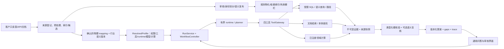

# SPEC v0.3：可换行业的本体语义与业务任务 POC Core

> 来源：[PRD v0.2](prd-industry-semantic-agent-v0.2.md)、[场景解耦约束](../docs/scenario-decoupling-2026-09-23.md)、用户提供的《推理层理论基础 2.0》（2026-09-15）与《非结构化真理源消歧理论方案 v2》（2026-09-10）。
> 基线：`feat/local-poc-core-20260923` + `main@02b86e6`；实施分支：`feat/poc-core-capabilities`。本文是目标合同，不把理论文档对其他项目的代码盘点当作本仓库现状，也不假设 DataOS 有可复用本体能力。

## 1. 目标与完成口径

当前本地产品只能按关键词回答 SOC 均值或运行家庭能源候选仿真，数据和答案写法固定在 `local-product.ts`。v0.3 要让交付人员以版本化 profile 挂载**不同来源、物理 schema、行业语义、工具和场景操作**，让业务用户在同一正式 `POST /runs` 链路中完成下表任务。每次回答都区分真实来源、推导、假设、缺口和核验范围。

| 任务类 | 最低可运行示例 | 必需输出 |
| --- | --- | --- |
| 单次结构化查询 | 站点 SOC、某区待巡检设施数量 | 来源范围、字段/单位、结果与证据；不需要本体时可走受限 direct query |
| 语义查询与多跳导航 | 设施→巡检→工单→依据，或设备→位置→告警 | 已确认 mapping/关系上的确定性路径或有界连接；缺边时返回 gap，不让 LLM 猜关系 |
| 文档有据问答 | 一份版本化政策文件规定某事项的材料条件 | 结论、页/段/span、文件版本/有效期；检索片段不是自动发布的事实 |
| 实体消歧 | 同名设施/机构来自两份资料 | match / create_pending / clarify / reject 的可解释决定；未知不得强合并 |
| 确定性判定 | 已发布规则判断事项/设备是否满足条件 | 规则版本、逐项前提、例外处理、适用时间、冲突/未知 |
| 派生事实 | 文档/结构化事实更新后重算满足规则的结论 | explicit/derived 分离、依赖链、增量重算、撤回后当前视图与历史视图一致 |
| 场景计算 | 家庭储能候选计划 | 已注册计算 handler、输入假设、轨迹、约束和基线；不执行设备动作 |

完成不以“能自由问任何话”或“任务卡 done”计。必须让至少**能源 A/B 两种物理结构 + 交通设施/政务一个非能源配置 + 一组用户导入的非结构化文档**，通过可启动产品的正式 API/页面走完相应路径。非能源配置不得要求修改通用 Controller、ToolGateway、核验或 App 壳。用户数据源没有权限、模型/后端未配置、规则无法表达、证据不完整时明确拒绝或澄清。

## 2. 已有能力与必须补的接线

优先复用现有 `ProfileSpec/ResolvedProfile`、`SemanticMapping`、DuckDB/PostgreSQL 只读适配器、`ExtractionPipeline`、`IdentityDecisionService`、`SemanticPublicationService`、`RuleMaterializationService`、`OntologyLookupService`、四工具 `ToolGateway`、`RunPlanner`、`WorkflowController`、Postgres 控制/证据存储和本地 blob。不要重新造一个平行控制器或一套万能插件 API。

当前缺口是**产品装配和契约缺口**：本地宿主只创建两份合成 SOC 表，只注册 `data_query`，runtime 用关键词切两个分支，草稿写入器只认识 SOC 与四个能源数值。配置工作台、导入/候选/审核/规则/历史路由虽有组件，却没有构成一个可由交付人员接入数据、发布语义、再由业务用户查询的同一部署。`DraftClaim` 的数字值和 claim-only 可见块也不足以核验文档、字符串、关系、规则结论。工作流 manifest 已落 Postgres，但跨进程更新尚无 CAS；跨页读取虽有上限与显式失败，未固定并发快照。这些不能用再添加几个关键词或演示答案规避。

## 3. 总体架构与可替换边界

`DataOS` 在本部署只可作为**有契约、可探测的数据来源**；本体定义、消歧、规则和推导由本项目的语义/应用模块提供。行业包负责概念、关系、单位、身份范围与规则模板，不含客户表名、URL、密钥或实例。客户 mapping 绑定物理对象与转换；复杂长表/JSON 用可追溯的有界预处理。数据后端、runtime、模型、场景计算和本地/MCP 传输独立注入，用户问题不能选择任意代码、物理表或新工具。main 的通用 App/API 壳只收场景贡献，功能分支必须沿用该边界。

一个部署可同时绑定结构化源和文档检索源。能力预检必须区别 `configured`、`ready`、`degraded`、`unavailable`；不能把存在接口/包当作已接入。一次 run 固定 profile 快照、mapping/定义/规则版本、来源授权、预算和策略；切换配置只影响新 run。

## 4. 数据接入、抽取与一致划分

### 4.1 用户可提供的数据

交付侧至少支持：一个有权限的只读 SQL 来源及一份 PDF/Markdown/文本文件。按现有来源登记、探测、导入 job、blob/文档解析端口接线；如缺内容上传入口，增加**受控 operator 导入入口或 CLI**，只接收明确文件类型、大小/页数上限、媒体类型、原文件摘要和来源版本。不得接收模型提供的任意本地路径或连接密钥。全文、规范文本、chunk、页/段/span、解析器版本分别留可重读引用。大文档异步分页/分块处理，有检查点、并发上限、重试上限与可见截断。

结构化数据先探测真实 schema、权限、身份列、时间列与能力；只能查询已登记的表/视图，参数绑定，不允许写 SQL。复杂转换产生版本化规范表或视图，并记录原始 sourceRef、transformRef、源水位和结果摘要。DuckDB demo 仍可保留，但不能是唯一接入路径。业务库与控制/审核/证据库存储隔离。

### 4.2 非结构化到候选：六步但不六套真理

理论文档的 `e → n → g → r → δ → α` 用作职责划分：抽取 mention/关系/规则候选与原文位置；无损归一并保留删去的表面特征在上下文；按行业类型、时间、权限和键阻塞召回候选；给出可解释的证据分数；输出 match/create_pending/clarify/reject 提议；审核后把一致划分及事实写入正式视图。LLM/生成模型只提出候选、SQL 或计划，不能直接发布事实。抽取召回和身份判定分开评测；漏抽不能算作“消歧正确”。

归一化必须幂等；简称/别名来自经确认的语句而非硬编码同义词。强标识、identity scope/type、must-link、cannot-link 和有效时间是确定性硬约束。逐对分数**不等于**可发布的等价关系：每次发布或修订须生成/检查一个传递封闭、无 cannot-link 冲突的划分版本。首版允许按作用域分桶、受限贪心/局部修复，不宣称全局最优；冲突时停在 clarify/review，不靠传递闭包强行合并。现有 append-only 身份决策与 split/outbox 可复用，新增划分版本/一致性审计而不是覆盖旧记录。

真理源语句可声明来源可靠度 `rho`、生命周期及证据，但权威来源也可能出错；可靠度不是执行许可。高影响或枢纽实体的错误合并成本更高，必须更保守。NIL/新实体先验、Good–Turing singleton 率和分数校准只在样本/标签足够且版本已记录时给出数值；不足时写 `unavailable`，不能把启发式阈值伪装成已校准概率。人工审核/澄清结果进入 append-only 反馈与后续评测。

### 4.3 双时态、撤回与派生

实体、别名、显式语句、规则、派生结果都需可按 `valid-time`（业务成立）和 `transaction-time`（系统获知）读。`expansion` 新增、`revision` 追加新版本并关闭被替代版本、`contraction` 标记失效/关闭区间，**不物理删除历史 ID、证据或负例约束**。当前查询默认只读该时点活跃视图，历史查询固定 as-of 与版本；缺时间上下文时不得把过去别名当当前身份。

派生事实与显式事实物理/逻辑分离。每个派生版本记录规则版本、AND 前提组、OR 替代支撑、来源、计算水位及两类时间。前提、身份、规则或来源收缩时，事务提交失效栅栏，消费者先返回 `pending/dirty`；worker 仅重算依赖索引标出的范围。最后一个有效支撑消失时级联收缩，替代支撑仍有效则保留当前结论；历史版本可回放。超过有界页数或不能固定一致快照时返回 `INCOMPLETE_PUBLISHED_READ`/pending，不用第一页冒充全量。

## 5. 在线规划、工具和最终回答

### 5.1 路由与执行

运行入口保留 `POST /api/v1/runs`。一个有界 planner 在确认上下文/版本后选择：已发布固定计划、一次 direct/semantic 查询、文档证据查询、已登记图路径/规则求值、已注册场景计算，或小型多步 DAG。明确问题走确定性模板；真有歧义时 JEV 可给**带 optionSet/version 的概率判断**供代码选择或澄清，生成模型只提出受 schema 限制的查询/步骤。JEV 不生成文字、不代算物理量、不判断规则真伪。没有模型资源时只执行有确定路径的任务，其余返回澄清/能力缺口；不凭关键词把不支持的问题改答 SOC。

模型可选公共工具仍只有 `ontology_lookup`、`data_query`、`document_search`、`web_search`；领域算法经 `data_query.kind=compute` 的版本化 operation 注册。`ontology_lookup` 可按已发布定义与关系提供有界路径/局部语义，`data_query` 负责受限 SQL 与确定性规则/图计算，文档检索提供 span 而非真理，Web 仅在 profile 授权时可用。所有路径使用同一个 ToolGateway、租户/空间权限、来源白名单、预算账本、取消与证据写入；本地/MCP 只换传输，不换语义。

多跳导航只在已确认实体和关系上计算，显式限定 hop、fanout、行数、时间和扫描预算；LLM 可以提议起点/终点，路径由确定性查询/图工具给出。判定型任务使用已发布规则的有界 AST；否定/例外或跨实体绑定未被引擎正确支持时拒绝，不能丢条件后标真。派生事实型任务在更新期物化，查询期读带水位的结果。不得开启第二个与 Controller 竞争的无限 Agent 循环。

### 5.2 类型化答案与核验

将现有数字型 `DraftClaim` 兼容扩展为版本化 `VerifiedAssertion`：`number/quantity`、`string/enum`、`boolean`、`entity_ref`、`relation_ref`、`rule_judgement`、`document_quote` 和 `artifact_summary`。每项携带主体、谓词、值/单位、业务时间、来源 evidenceRef/resultDigest/JSON pointer 或文档 span、推导/显式标记。硬检查按类型比较实际归档结果、单位、主体、时间、来源权限、规则前提和文件内容摘要；不能读取/不匹配即 fail。可见 block 必须引用通过核验的 assertion 或受限模板；未经核验的自由文本、模型推断、引文改写不能混进已发布正文。

最终响应显式给出 `(answer, confidence?, trace, gaps)`：`answer` 是可读结论与结构化数据/场景 artifact；`trace` 是证据、规则、来源/映射/模型版本和依赖链；`gaps` 区分 unknown、conflict、stale、truncated、unsupported；`confidence` 只有来源可靠度、校准模型与传播策略均版本化且适用时才展示，否则省略，不能用 JEV 选择概率冒充事实置信。旧数字答案可继续读取；迁移应保留已发布内容哈希/verificationRef 与不可变正文，新增字段版本化。计划轨迹等大 artifact 从已发布答案的证据引用只读展开，明确其与逐项 claim 核验范围的差别。

## 6. 产品装配与 API

本地 host 从部署配置/已激活 profile 的可信引用装配来源、mapping、行业定义、runtime、四工具子集、compute handler、模型与策略；只在装配层出现 `home-energy` 或 `transport`，不能在通用 `WorkflowController`、`DataQueryHandler`、`DraftVerificationService`、`App` 中添加行业 `if/regex`。场景 renderer 用 main 的 `AppViewContribution`；通用问答只拿部署提供的 profile、时区、任务能力。能源字段在能源场景模块，交通/文档模块按需贡献输入与展示；不用“一行业一条长期分支”维护同一核心。

复用现有 HTTP 路由：`/sources`、`/profiles` 预检/激活、`/ingestions`/`/jobs`、`/candidates`/`/decisions`/`/semantic-publications`、`/runs`/events/answer、`/evidence`/history 与能源场景路由。新增端点仅填无法由现有合同表达的缺口：授权文件导入、划分审计/澄清、类型化答案或物化进度。所有新端点沿用 C6 `{data,meta}` / `{error,traceId}`、可信身份、幂等键、If-Match/CAS 和有界分页；不能直接把服务内部 store 暴露成调试 API。业务问答保持 run ID 与最终 answer 分离，运行中不显示草稿正文。

| 错误/状态 | 触发 | 外部行为 |
| --- | --- | --- |
| `CAPABILITY_NOT_CONFIGURED` | profile 缺 adapter/model/操作 | 409，列出缺失能力；不假装已配置 |
| `INSUFFICIENT_DATA` / `UNKNOWN` | 实体未接地、缺前提、无匹配来源 | gap/clarify，不发布普通已核验结论 |
| `DATA_CONFLICT` / `IDENTITY_CONSTRAINT_CONFLICT` | must/cannot-link 矛盾、两证据冲突 | 审核/澄清；保留来源与版本 |
| `INCOMPLETE_PUBLISHED_READ` / `SNAPSHOT_UNAVAILABLE` | 截断、跨页版本不一致 | pending/gap；禁止用不完整集判不存在 |
| `UNSUPPORTED_QUERY` / `UNSUPPORTED_RULE` | 关系/例外/运算超出受限子集 | 明示支持边界；不可丢条件继续 |
| `VERIFICATION_FAILED` | claim/时间/引文/证据不匹配 | 阻止发布；有界修复与同一预算 |
| `SOURCE_UNAVAILABLE` / `DEADLINE_EXCEEDED` | 来源/模型超时或取消 | 有界重试，保留 unknown usage 与取消栅栏 |

## 7. 安全、规模与迁移

- 租户/空间/角色、来源与资源范围只能由服务端可信上下文决定；文档、工具结果、prompt、模型文本全是不可信数据。客户密钥用 `SecretRef`/环境注入，不进入 Git、证据摘要或浏览器。第一版 loopback principal 仅供本机，不可作为生产认证。
- 用户数据量未知，所有导入、候选、路径、SQL、证据展开和派生读取都需上限、分页/游标、超时、取消与来源水位。文档解析/抽取异步，模型 API 按公司配额限并发；不在每次问答重跑全量抽取/物化。不承诺“任意规模直接可用”。
- 新迁移追加表/字段与索引，不修改旧已发布记录。先升级 reader 再 writer；旧 run 锁定旧 profile/mapping/答案版本仍可读，不能被新部署悄悄解释。并发 workflow manifest/state 写入须加 revision CAS，不能把单进程本地成功算多实例恢复。
- 真实 HA 读与设备执行仍受外部接口/设备资料约束；本 SPEC 中所有能源动作保持只读仿真。不存在的模型或来源以未配置报告，不调用用户此前在聊天里给出的密钥，也不将其复制入代码。

## 8. 实施波次与验收门槛

每一波以正式端点/持久化行为验收，不以只跑 mock harness 结案。Luna 开发时可在同一隔离 worktree 内按依赖推进；主代理独立复验并复查数据/场景解耦。

1. **装配与合同**：把 `local-product.ts` 的固定关键词、合成 profile/能源草稿写法移到场景模块；增加部署 profile 装配与任务注册，通用 host 可挂能源及非能源。新增类型化 assertion 及旧答案兼容 reader，先用受控数据端到端证明三种不同问题不再由固定两分支决定。
2. **数据与候选闭环**：用户提供只读表和一份文档→受限接入/解析/span→候选抽取→身份 recall/三态决定→人工审核→发布；不配置公司模型时允许显式人工/受控候选路径，但不能虚报自动抽取成功。
3. **一致性与生命周期**：身份划分版本与 must/cannot-link 审计，双时态查询，显式/派生隔离，变更驱动物化、失效栅栏和级联收缩。保留替代支撑与历史回放。
4. **在线推理与多路径回答**：已发布本体语义辅助 SQL、确定性多跳、规则判断、文档有据回答、可选 direct query 与能源计算在一个 runtime/四工具合同下工作；JEV/生成模型按实际已配置能力接入，缺资源时澄清而非伪造。
5. **质量与替换性**：能源 A/B 和交通/政务两类 schema，同题映射等价及跨行业不同语义；正反例/held-out 测试覆盖错误合并、矛盾环、无依据引文、规则例外、撤回幽灵、长链截断、跨租户访问、取消迟到和重启读回。抽取 recall、实体 precision/recall、B-cubed、误判期望成本、ECE、路径正确率、核验 false-pass 分开计数；样本不足时 ECE 标不可用。

**总验收**：用户从同一页面/公开 API 对至少六个任务类提交问题，得到与业务数据对应的已核验答案或明确 gap；能导入自己的有权限来源而不改共享框架；抽取/消歧/审核/发布/推理/撤回具备真实状态与历史；更换行业/物理 schema 时共享 App/API/Controller/Gateway/Verifier 不变。`pnpm run lint`、`typecheck`、`test`、边界、真实 PostgreSQL/浏览器 E2E 全通过；外部模型若缺凭据，报告未验证而非用替身冒充 live。只有这些证据成立，功能分支才可称为完成。
