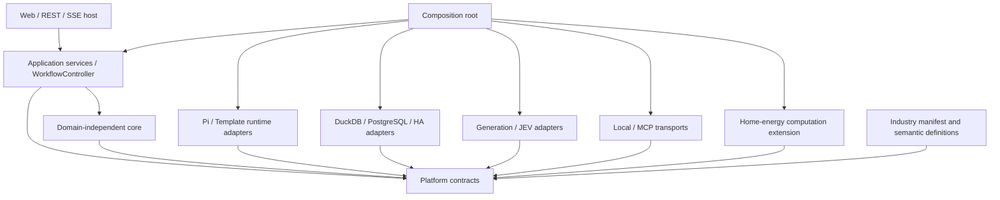
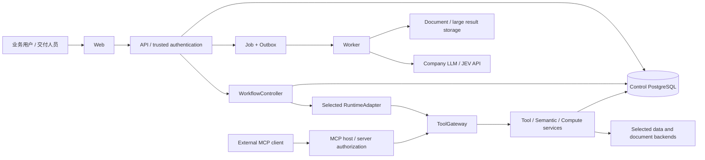

# SPEC v0.2：可组合行业语义与业务 Agent 平台

日期：2026-09-21｜状态：技术评审稿，未实现｜工程：`D:/work/ontology`，关联 `Yijtu/ontology`。文档整理前 Git 基线：`main@9ac2be912b3391e4870874a6639efa635b4ac3fd`；本稿尚未提交。

输入：[PRD v0.2](prd-industry-semantic-agent-v0.2.md)、[家庭充电储能场景](scenario-home-energy-hackathon.md)。覆盖 US-001—US-025、FR-1—FR-34。用户补充的最高设计约束：不得为了局部交付便利舍弃行业包、运行时、工具传输、数据接入、领域计算与模型的必要解耦。

## 0. 文档导航与效力

| 文档 | 实现时解决的问题 |
|---|---|
| 本文 | 总体架构、决策、依赖方向、交付切片与风险 |
| [组件与 API 契约](spec-v0.2/contracts-api.md) | 场景装配、运行时/数据/模型/工具端口、HTTP、MCP、错误与授权 |
| [数据与执行语义](spec-v0.2/data-execution.md) | 持久化、抽取/消歧、物化、时态、运行状态机与核验 |
| [家庭能源扩展](spec-v0.2/home-energy.md) | 本体包、时间序列映射、候选计划、仿真、设备执行边界 |
| [验证与任务映射](spec-v0.2/verification-plan.md) | US/FR/验收到测试映射、独立夹具、替换矩阵、负载与实现顺序 |

各分册为本 SPEC 的规范组成，不是可忽略附件。PRD 优先规定产品范围；本 SPEC 解决实现选择。资料/框架文档不能覆盖用户授权。本文只创建规格，没有运行模型、安装框架、连接设备或启动开发。

## 1. 架构决策

| ADR | 决策 | 原因与代价 |
|---|---|---|
| ADR-01 | TypeScript 应用层、模块化单体 + 独立 Worker | 减少进程复杂度，保留可拆端口；解析/计算可通过 RPC 使用其他语言 |
| ADR-02 | 端口/适配器 + 独立包 + 架构依赖检查 | 解耦是编译与契约测试约束，不是仅创建 interfaces 目录 |
| ADR-03 | Pi 动态运行时 + template 运行时 | 两个真实适配器验证可替换性；不要求首版接入第二套重型 Agent 框架 |
| ADR-04 | 四个公共数据工具，生成/核验/发布由控制器掌握 | 工具传输和 SDK 不能绕过平台完成条件 |
| ADR-05 | 本地直调 + MCP 共用工具服务 | 保留跨进程能力，不以强制网络跳转充当解耦 |
| ADR-06 | 控制存储 PostgreSQL，业务查询 DuckDB + PostgreSQL 起步 | 控制一致性与业务查询分开；两个真实 SQL 后端验证方言和映射替换。StarRocks/Iceberg 为后续适配 |
| ADR-07 | 文档检索首版 BM25/关键词适配，向量适配可独立加入 | RAG 不等于必须部署 Milvus；共享检索端口与证据契约，不能虚报向量模式 |
| ADR-08 | 本地不可变对象存储起步，预留 S3 兼容适配 | 解析文件/大结果不塞控制表；引用、校验和与访问授权统一 |
| ADR-09 | 普通生成模型与 JEV 使用不同端口 | JEV 的概率决策不冒充生成器，概率语义不被统一 chat 接口抹掉 |
| ADR-10 | 行业声明包与可执行领域扩展分离 | 本体包不包含任意脚本；能源公式在可信计算模块，不进入平台 core |
| ADR-11 | 能源计算采用 `data_query.kind=compute` 的版本化联合契约 | 保持四工具目录；计算操作须事先注册和授权，禁止万能 eval/query 字符串 |
| ADR-12 | 真实设备 ActionPort 保留契约但不启用驱动 | 当前无设备/API资料；仿真闭环可实现，不能把模拟成功当作实机成功 |
| ADR-13 | 追加版本 + 局部投影 + 依赖更新 | 原始/派生及历史留痕；不在每次问答全库重放，也不靠删历史简化撤回 |
| ADR-14 | 一份运行清单、一个共享预算账本、一个收证循环所有者 | 避免 planner/runtime/verifier 各自循环或补查重置预算 |

工程根目录为 `D:/work/ontology`，推荐实现工作区为其下 `platform/`；本轮不创建实现目录。接口、数据模型与测试按当前规格独立设计，不以历史原型作为后端、迁移源或行为金标。无需继承其标识符、事件格式、数据库、目录结构或测试数量。

运行时基础版本建议 Node.js 22 LTS、TypeScript strict、pnpm workspace；实现第一个任务核对 Pi/驱动要求并锁入 lockfile，若需更高 Node 版本只修改 host/adapter 构建配置，不改变业务契约。Web/API 选 Fastify + React/Vite，核心包不依赖 HTTP/React。单元/契约用 Vitest，浏览器用 Playwright；这些是规格选型，尚未安装。

## 2. 必须保持的依赖方向



### 2.1 边界不变量

- INV-01：`contracts` 只含数据类型、JSON Schema、版本与错误定义，不 import SDK、数据库、HTTP 或行业包。
- INV-02：core/application 不 import Pi、MCP SDK、数据库驱动或 home-energy；依赖均以构造注入端口传入。
- INV-03：行业声明包只包含数据和声明式约束；不绑定运行时、连接地址、密钥或物理列名。
- INV-04：查询服务不因换 runtime 而更改；runtime 不直接查询库或打开领域文件，只能调用注入的 gateway。
- INV-05：同一领域实现支持本地/MCP；接入方式不能改变权限、结果完整性、证据或核验要求。
- INV-06：业务后端不充当唯一控制真理源；切换数据源不会丢运行、审核或证据历史。
- INV-07：MCP 工具结果/注解与 LLM 输出不能声明自身具备更高权限；主体由可信身份上下文确定。
- INV-08：能源求解、时序含义与参数不能出现在通用 core；声明 `compute.home-energy.plan` 的组件提供能力。
- INV-09：框架事件与草稿不得作为已核验答案发布；只有 controller 可签发最终 answer version。
- INV-10：模拟、真实观测、预测和设备执行状态必须在契约中显式区分，不靠 UI 文案区分。

CI 执行 workspace import graph 检查，阻止反向依赖；使用按 package 的类型导出限制和 eslint dependency-boundary 规则。至少两个 runtime、两个同类 SQL 后端和两种工具路径通过同一契约套件；具体组合见验证分册。

### 2.2 包与拟新增文件目录

```text
platform/
  apps/{api,worker,web}/
  packages/contracts/             # canonical JSON Schema / generated TS types
  packages/core/                  # policy, compatibility, budgets, state transitions
  packages/application/           # profile/run/ingestion/semantic/publication services
  packages/tool-services/         # ontology_lookup/data_query/document_search/web_search
  packages/semantic-engine/       # canonical facts, identity decisions, rule evaluation
  packages/provenance/            # evidence/dependencies/time views
  packages/adapters/runtime-{pi,template}/
  packages/adapters/model-{company,jev}/
  packages/adapters/data-{duckdb,postgres,ha}/
  packages/adapters/search-bm25/
  packages/adapters/control-postgres/
  packages/adapters/blob-{local,s3}/
  packages/adapters/transport-{local,mcp}/
  packages/adapters/extraction-document/
  packages/extensions/home-energy/  # typed compute handlers, no platform imports
  industry-packs/{home-energy,transport-government,health-services,automotive}/
  deployment-profiles/            # refs only, no secrets/customer payloads
  migrations/control/
  tests/{contracts,composition,integration,e2e,load,fixtures}/
```

目录表示职责和依赖，不要求每包单独部署。`data-ha`、`blob-s3` 首期可以只有明确的契约和未就绪声明，不得注册为已支持；其他行业同理。DuckDB/PostgreSQL/template/Pi/本地/MCP 是首版解耦验收中的真实实现，不以 mock 代替。

## 3. 系统上下文与部署



API 和 Worker 可运行在同一机器但隔离生命周期；控制库可与业务 PostgreSQL 共实例、不同 schema/角色/连接池，不共用 Repository。模型、数据、文件与执行能力各自可替换。

应用认证：开发使用仅 loopback 生效的 local-dev principal；生产接入经过验证的 OIDC JWT/JWKS，issuer/audience 与角色映射由部署配置决定。禁止在公网模式启用固定开发主体。MCP stdio 从受信 launcher 获得限定 principal；远程 HTTP 接入另做 token audience/认证协商，不把模型传来的 tenant_id 当凭证。

离线演示使用合成遥测、设备参数、价格与 forecast fixture。只连公司模型 API 的集成测试需要独立显式运行；本 SPEC 不消费用户曾提供的密钥。

## 4. 核心执行与交互

### 4.1 两套状态独立

后台文档：`received → parsed → extracted → validated → awaiting_review → published`，另有 `failed/cancelled/rejected`。解析/抽取/审核各自检查点，发布事务保证版本一次生效。

问答：`created → preflight → collecting → drafting → verifying → published`，另有 `awaiting_input/cancelling/cancelled/blocked/failed`。补证据返回 collecting，改表述返回 drafting；所有轮次共享预算。业务失败与平台失败分别编码。

前端只展示可审计进度、工具摘要、已验证数据；未核验草稿不作为答案 token stream 对用户发送。最终 answer_id 绑定 draft_hash、evidence_manifest_hash、verification_id 和场景版本清单。

### 4.2 模型与 RuntimeAdapter 的区别

GenerationPort 提供流式文本/结构化候选/tool-call 能力；DecisionPort 提供 JEV 类型化判断。Pi 的 provider 数据结构只在 runtime-pi/model-company 适配内转换，不能成为核心领域类型。

Pi 负责收证阶段的循环；注入的每个 tool.execute 只能调用 gateway，SDK 的 stop/cancel hooks 对齐平台预算。SDK 最终自然语言消息只是 candidate，不自动发布。TemplateRuntime 用相同 gateway 顺序/并行执行已登记计划；无未知依赖时可完成同样任务。

controller 只切外层阶段，不另开与 runtime 并行竞争的规划循环。领域计算 handler 内可以迭代数值算法，但不能再启动自主 Agent、联网或调用秘密工具；其 CPU/时间预算独立计量并受全局 deadline 限制。

### 4.3 解耦与状态恢复

每 run 保存不可变场景清单和 resolved capabilities。checkpoint 分平台公共状态与 runtime 私有 blob；私有部分含 SDK/adapter 版本和 hash。默认只由相同 runtime/版本恢复。跨内核转移只能显式创建新 run 复用仍有效的证据，不宣称任意 checkpoint 兼容。

解析过的领域意图保存在公共状态；大数据只存引用。取消传播至模型、SQL、MCP、计算；不能真正取消的远程调用标记 abandoned，迟到结果留审计且不得复活/发布已取消 run。

## 5. 数据模型与 API

完整定义分别位于 [数据分册](spec-v0.2/data-execution.md) 与 [契约分册](spec-v0.2/contracts-api.md)。所有实体 ID、版本和 FK 以 tenant/space 为边界；业务 canonical ID 不从可变显示名直接构造。

API 命名空间 `/api/v1`，按本规格定义全新契约，无历史演示接口兼容层。列表使用 opaque cursor；schema、profile 和审核写入使用 If-Match/revision；任务/运行创建使用 Idempotency-Key。

基础入口包括组件注册、场景预检/激活、来源检查、导入任务、候选审核、语义发布、runs/events/answers、evidence/history、materialization jobs 与 simulations。实机执行接口属于预留能力，默认返回 `CAPABILITY_NOT_CONFIGURED`，不提供通用 HA service pass-through。

## 6. 存储初始化与版本演进

首期 control-postgres 存不可变版本、审核、运行、预算、事件、证据依赖；blob-local 存原文/大结果，内容寻址加租户访问元数据；DuckDB 固定数据快照与 Postgres read-only adapter 提供对照业务查询。

BM25 端口提供可重建索引与显式 index version，底层语料按 tenant/space 隔离。vector/hybrid 需要对应已注册后端后才显示可用。初期没有向量数据库不影响关键词 RAG，但也不能报告完成 Milvus 支持。

测试数据根据当前领域语义、接口契约和独立确认的预期结果构造，包含替代支撑、撤回、未知/冲突、边界和双时间案例。它们在本仓库内完全可重建；无需导出历史原型数据、保存旧 ID 映射或建立旧版本转换器。新实现通过规格金标与不变量测试验收，不通过“与旧实现一致”验收。

第一批 SQL migrations 在本项目 control schema 建表，表示新系统自身的数据库初始化和演进。启用前端/后端以 profile 指向，回退为切换新会话入口；已发布语义/事实历史不会随应用回滚被删除。未来确有客户存量数据接入时另行定义导入和验证任务，当前不包含原型数据迁移。

## 7. 家庭储能首场景

行业包使用 `home-energy` namespace；设备、测点、计量边界、价格、forecast、约束和计划均有语义契约。能源公式/策略属于 `extensions/home-energy`，与 runtime、数据库和 MCP 无直接依赖。

采用场景补充的方案 A：`data_query` 内显式受限 `compute` union 调用 `home-energy.plan@1` / `home-energy.simulate@1`。操作清单在注册阶段确定，可禁用，不接受任意代码。此选择保持四工具目录，同时计算服务独立，未来可以新工具版本暴露同一领域服务。

首版只实现模拟执行，输入/输出标明 synthetic/observed/forecast 与 simulation/live。HA 当前只设计读取适配契约；设备型号、读写 API、官方规则不明时不能宣称完成接入。真实 ActionPort 的能力、确认令牌、幂等与回读预留在能源分册，驱动与启用另行确认。

## 8. 错误、可观测性与约束

错误统一分为合同/身份/依赖、资源/超时、数据质量/语义、核验与设备能力。错误携带 code、retryable、safe_message、trace_id，不携带密钥或完整客户 payload；详表见契约分册。

所有工具调用在开始前持久化 intent 与预算预留，结束记录状态、实际用量和证据 ID。成功业务结果要求证据先提交；证据存储失败不能返回“已可追溯成功”。模型超时的远端是否计费可能未知，应记 usage_unknown，不释放为免费额度。

采集单次/累计时延、JEV/生成模型调用、上下文/输出大小、SQL扫描/结果、任务积压、投影水位、核验误放行、取消迟到、缺失/冲突与降级。日志与数据内容分离，调试读取需权限；来源文本中的指令作为数据处理。

模型不能变更白名单、用户、数据库绑定、预算或发布状态。SQL 解析/验证、只读数据库角色与行列范围是多层约束；MCP annotations 与只读标记不是授权凭据。

## 9. 性能目标与验收口径

数据量未知，设置研究基线而非客户 SLA：参考机器 4 vCPU/8 GiB；小集 100 文档/10k 断言/100k 遥测行，中集 1k 文档/100k 断言/1m 遥测行，大集为后续容量探测。各维度独立构造，不暗示文档与断言固定比例。

提议首轮目标：非模型控制 API P95 ≤500ms；本地工具查询 P95 ≤2s；24 小时/96 时隙/10 策略以下仿真 ≤2s；4 并发 run 下控制响应不被大解析阻塞。真实模型端到端时延单列，当前均未实测。若未达标，记录结果和瓶颈，不通过删掉挂载/核验/证据功能“达标”。

初始可调整预算：run 120s、8 次数据工具调用、2 次补查/草稿修复共享计数、2 个独立并行工具、结果默认100行/上限1000行、模型可见工具摘要上限32KiB；导入/仿真后台 job 有单独预算。场景及部署可收紧，模型不可放宽。具体模型 token 限制按已核实 API 建 capability config，不猜上下文大小。

负载报告包含支持范围、硬件、数据分布、缓存状态、模型版本和失败案例。溯源上限截断必须标记；路径/候选被截断时不能得出完备性或不存在结论。

## 10. 验证与实施顺序

[验证分册](spec-v0.2/verification-plan.md)逐条映射 25 个 US、34 个 FR 和能源附加验收。测试分为边界静态检查、端口契约、数据库/MCP真实集成、算法与时态、UI E2E、真实模型评测和容量探测。

实施按“contracts → composition/kernel → 两运行时与两数据适配 → 工具和核验闭环 → 语义入库/规则 → 能源场景 → 完整评测”推进。每波都保留现成运行切片，但不得通过 import 具体 SDK、硬编码家庭能源或直连库跳过必要边界。

任务列为设计 ID（S01…），对应细化的[本地 Issue 包](../.autoresearch/issues/INDEX.md)，不是 GitHub 编号。新目录已关联 `Yijtu/ontology`，本次迁移未创建远程 Issue，也未运行 loop-it。后续按用户明确的执行范围和 ready 条件推进。

## 11. 开放问题与局部阻塞

| 项目 | 当前默认 | 外部信息到位后处理 |
|---|---|---|
| 黑客松正式规则/是否要求实机/已有代码规则 | 先规划能源仿真，正式活动验收要求待核实 | 正式资料确认后调整 Demo 范围，不重写公共内核 |
| HA 设备/固件/实体/service | 未配置 live driver，simulation 默认 | 按 DeviceActionPort 验证，独立启用，不能仅填 URL 解锁 |
| 公司模型/JEV endpoint与配额 | 保留适配契约，CI 用确定响应 | 锁定实际接口版本，单独运行授权集成测试 |
| 鉴权/部署组织 | 开发 loopback principal；生产 OIDC | 补 issuer、audience 和角色，不更改工具参数信任边界 |
| 原始数据/价格地区/设备参数 | 合成夹具标明假设 | 增加映射和真实 fixture，来源标签不可省略 |
| StarRocks/Iceberg/Milvus | 未就绪插件，不作为首版必需部署 | 各自通过同套契约/容量测试才标 supported |

这些开放项不阻塞通用契约、仿真、假响应 E2E；它们阻塞的是对应真实集成的完成声明。不得为了让计划看起来完整而发明官方规格或运行数据。

## 12. 参考

- [Pi Agent Core](https://github.com/earendil-works/pi/blob/main/packages/agent/README.md)：工具执行、事件、stop hooks；不自动等于平台权限或可互换业务状态。
- [MCP tools](https://modelcontextprotocol.io/specification/2025-06-18/server/tools)：schema/structured results/error；首期协商兼容 2025-06-18 的必要子集，实施时锁具体 SDK 与协议测试。
- [PostgreSQL 行安全](https://www.postgresql.org/docs/current/ddl-rowsecurity.html)、[事务隔离](https://www.postgresql.org/docs/current/transaction-iso.html)：控制存储与来源快照参考，跨后端不假定全局快照。
- [DuckDB Node.js](https://duckdb.org/docs/stable/clients/node_neo/overview)：本地分析源候选；驱动版本实施时确认。
- [Home Assistant REST](https://developers.home-assistant.io/docs/api/rest/)、[Anker 集成](https://github.com/anker-charging/ha-anker-solix-official)：未来数据/设备适配参考，当前未连接。
- [Jev](https://docs.typesafe.ai/introduction)、[PROV-O](https://www.w3.org/TR/prov-o/)：概率决策和来源表达参考，不能替代业务正确性验证。
